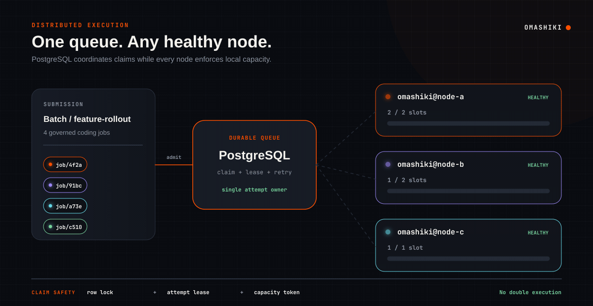

# Omashiki

> ### *Jobs, containers... and ~~chaos~~ worktrees.*

Omashiki is a local, durable queue runner for governed coding-agent jobs. It
admits work against registered repositories and environments, executes each
attempt in an isolated Docker container, and returns a clean committed Git
branch or a durable failure record.

The current plugin catalog includes OpenCode over HTTP, Claude Code, OpenAI
Codex, pi, and jcode over CLI transports. Presets select a plugin, while
environments select a `docker.<handler>.debian` runtime (`runc` or `kata`) and
its governed mounts, resource limits, caches, and network policy. Docker's `runc` and `kata`
handlers are implemented at the Docker API/configuration layer; runtime images
come from the corresponding `[runtimes.docker.<handler>.debian.images]` catalog.
Kata host installation and compatibility validation remain deployment
prerequisites; VMs are reserved for distributed execution tests. Callers cannot
select providers or inject authentication through a job payload.

## How It Runs

Jobs enter one durable PostgreSQL queue. Healthy nodes claim work under row
locks, attempt leases, and local capacity limits, so an attempt has one owner
even when execution is distributed.



Each admitted job carries an immutable environment snapshot. The claiming node
prepares a clean worktree and runs the selected plugin inside the selected
Docker runtime before returning a committed branch or durable failure.


## Quick Start

Prerequisites:

- Docker with Compose support
- [mise](https://mise.jdx.dev/)

From the repository root:

```bash
mise install
mise run up
```

`mise run up` starts PostgreSQL, installs dependencies, applies migrations,
builds missing agent images, and starts Phoenix in the foreground. The checked-
in configuration serves the local operator UI at <http://127.0.0.1:4010> with
authentication disabled for local development.

Edit `omashiki.toml` to register repositories, presets, environments, runtime
handler catalogs, credentials, caches, and limits. The execution registry
hot-reloads; changes to infrastructure settings still require a restart.

Install the bundled Agent Skill for compatible coding agents:

```bash
mise run skill:install
```

This copies the skill to `~/.agents/skills/omashiki/SKILL.md`. Run the command
again after updating Omashiki.

## Job Contract

The HTTP envelope uses `schema_version = 1`. Its `payload` field uses the
harness-neutral V2 payload contract:

```json
{
  "instruction": "Create hello.py and commit it.",
  "context": {
    "ticket": "EXAMPLE-123"
  }
}
```

`instruction` is required and `context` is an optional JSON object. Provider,
harness, model, and authentication controls are rejected from the payload.

## Validation

Install the versioned hook once per checkout:

```bash
mise run hooks:install
```

The `pre-push` hook and the manual command below execute the same local CI
script:

```bash
mise run ci
```

The standard E2E uses runc, jcode, and the deterministic local LLM stub. The
runner owns the stub lifecycle and takes a nonblocking lock because preparation
rewrites the shared ignored `omashiki.e2e.toml`:

```bash
mise run e2e:overture
```

Real providers remain explicit opt-ins: use `e2e:overture:runc:opencode`,
`e2e:overture:runc:claude`, or `e2e:overture:jcode:lmstudio`. To validate Kata,
run `mise run kata:install` once and then `mise run kata:smoke`; the smoke uses
exactly one disposable container in the host Docker daemon. VM tasks are only
for distributed execution tests. See [Contributing](CONTRIBUTING.md) for setup
and credential-rotation details.

## Documentation

- [Documentation index and ownership](docs/README.md)
- [Product requirements](docs/prd.md)
- [Architecture](docs/architecture.md)
- [Current requirements](docs/requirements.md)
- [Data model](docs/data-model.md)
- [Contributing](CONTRIBUTING.md)
- [Agent images](agent/README.md)

Canonical product and system documentation lives under `docs/`. Files next to
components document only how to build, operate, or maintain that component.

## License

Omashiki is available under the [MIT License](LICENSE).
