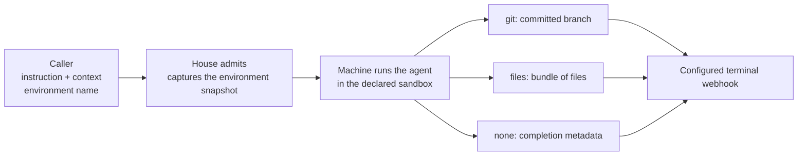
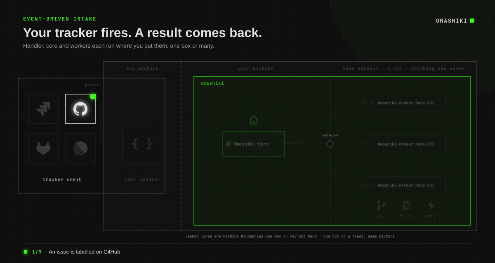
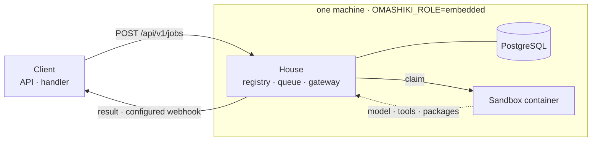
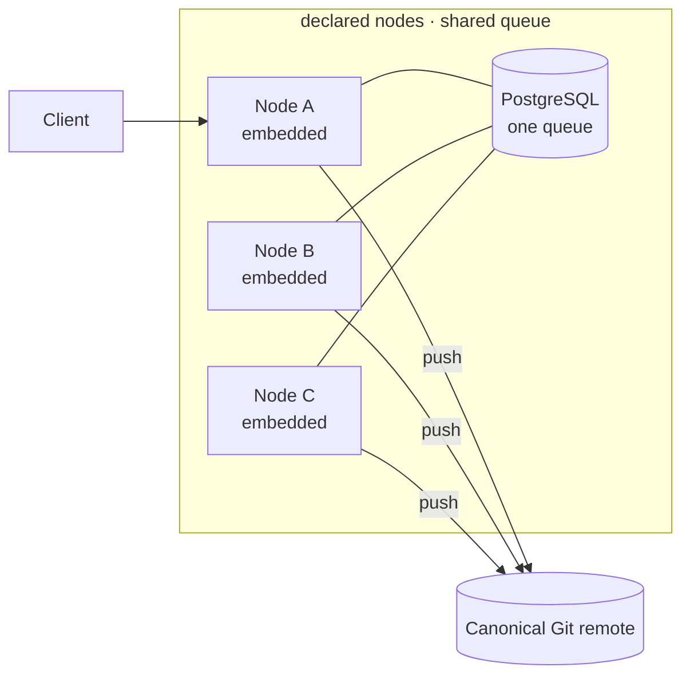
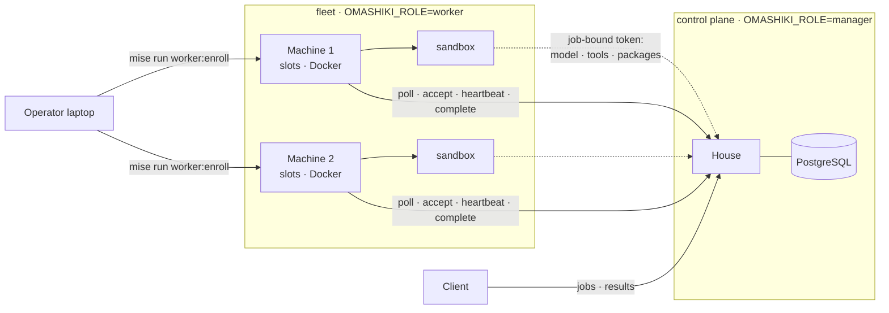
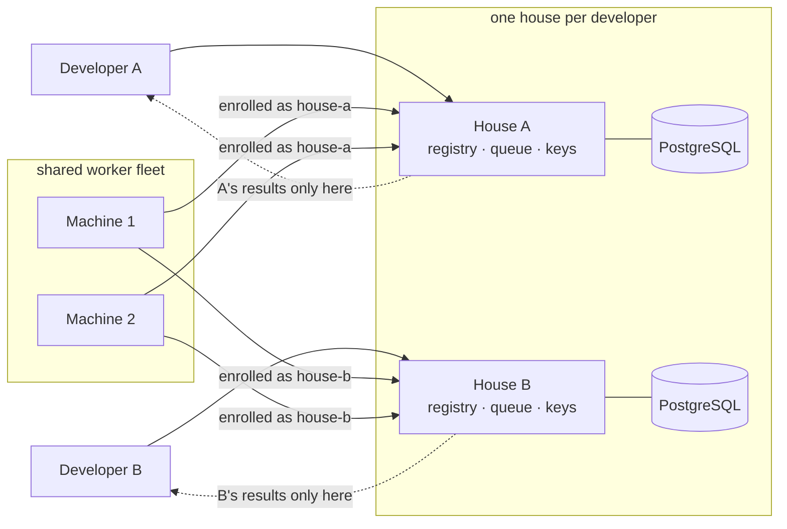
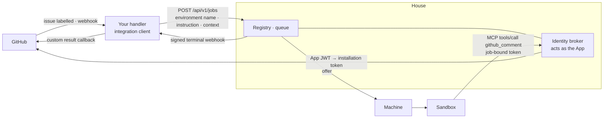

# Omashiki

 ### *Jobs, containers... and ~~chaos~~ worktrees.*

Omashiki runs agent jobs through a durable queue and controlled containers.
A client supplies an instruction and selects a registered environment.
The house stores the job, credentials, and result.
A machine executes the job with the tools and access declared by the operator.

Use one process on a laptop, or give several houses access to shared workers.
Supported plugins are OpenCode, Claude Code, OpenAI Codex, pi, and jcode.

## What a job can produce

The environment selects the result sink.
The client cannot override its runtime, credentials, mounts, or network policy.

| Sink | Result | Example work |
| --- | --- | --- |
| `git` | A verified committed branch. | Fix a bug, update a dependency, or write a versioned document. |
| `files` | A validated file archive with a digest. | Generate a report, convert documents, or prepare a dataset. |
| `none` | Completion metadata. | Read an issue, add a label, or comment through a declared tool. |



A `none` result does not contain a complete record of external changes.
Check the external system when you need to verify an action.

## Where work comes from

A handler can convert a tracker event, scheduled task, or form submission into `POST /api/v1/jobs`.
The request selects registered names and supplies an instruction with optional context.
When the token has a webhook destination, the house sends a signed terminal notification.



Gray identifies the external integration. Green identifies Omashiki.
The [reference GitHub handler](examples/handler/github_issue_handler.py) verifies events and submits labelled issues.
Its terminal callback logs results. Your integration must implement ticket comments or pull-request creation.

## Use cases

**Fix a labelled GitHub issue.** A handler sends the issue description and repository to the house.
The agent reproduces the failure, adds a test, and returns a branch for review.

**Implement a ready Jira ticket.** A handler converts the workflow transition into a job.
Acceptance criteria enter through `context`. The ticket key identifies the correlation.
The handler attaches the result to the ticket.
You supply the Jira connector and callback code.

**Update several repositories.** A scheduled script submits one job per repository and maintenance operation.
Each job has a separate idempotency key and result.
The operator reviews the branches before merging them.

**Prepare a report.** A files environment supplies the required tools and permitted inputs.
The agent writes output files. The house stores the validated archive.

**Delegate from an existing coding agent.** Install the skill from the running house:

```bash
mkdir -p "${HOME:?}/.agents/skills/omashiki"
curl --fail-with-body -sS "$OMASHIKI_URL/api/v1/agent-skill" \
  > "${HOME:?}/.agents/skills/omashiki/SKILL.md"
```

Ask the agent to discover registered environments, submit a bounded task, and retrieve the result.
The job continues after the client disconnects.

## Deployment shapes

The release supports three roles: `embedded`, `manager`, and `worker`.
Select the deployment that matches your database and execution requirements.

### 1. One machine

An embedded process runs the house and local job execution.
PostgreSQL stores the queue.
Use this deployment on a laptop or single server.



Use [the single-node configuration](examples/single-node.omashiki.toml) and [installation procedure](docs/how-to-install-and-stop.md).

### 2. One house, several nodes, one queue

Several embedded nodes share PostgreSQL.
Each node has a declared identity and execution capacity.
Canonical Git remotes make results accessible outside the execution node.



Use [the multi-node configuration](examples/multi-node.omashiki.toml).
This deployment gives each embedded node database access.

### 3. One house with several workers

The manager owns PostgreSQL and the registry.
Workers control Docker and local slots without database access.
Each worker enrolls into the house over HTTP.



Follow [worker setup](docs/how-to-add-a-worker.md).
The worker and its job containers must reach the manager's data-plane endpoints.

### 4. Several houses with shared workers

Each house keeps its own queue, registry, credentials, and results.
A worker can enroll into each house with a distinct manager ID.
The worker shares one local slot limit across those houses.



Follow [shared-worker setup](docs/how-to-share-workers-between-houses.md).
A failed house connection does not remove other enrollments.

### 5. An agent identity and an integration handler

The handler submits tracker work as a client of the house.
The agent identity lets the running agent act as a GitHub App through the house broker.
These roles use separate credentials and configuration.



The house retains the App private key and installation token.
Only OpenCode currently receives the identity MCP configuration.
Follow [identity setup](docs/how-to-configure-an-agent-identity.md) and [tracker integration](docs/how-to-connect-an-issue-tracker.md).

## Start here

You need Linux, Docker with Compose support, and mise.
From the checkout root:

```bash
mise install
mise run up
```

The task starts the local house at <http://127.0.0.1:4010> with the checked-in configuration.
Configure repository and model access before submitting a real job.

[The documentation index](docs/README.md) follows the operating sequence:
install, register a repository, configure an agent, submit work, and retrieve its result.
Read [security and limits](docs/security-and-limits.md) and [known limitations](docs/what-does-not-work.md) for deployment constraints.

## Development

[The internal documentation](docs/internal/README.md) contains development setup, tests, architecture, requirements, and implementation records.
Start with [contributing](docs/internal/contributing.md).

## License

Omashiki uses the [MIT License](LICENSE).
