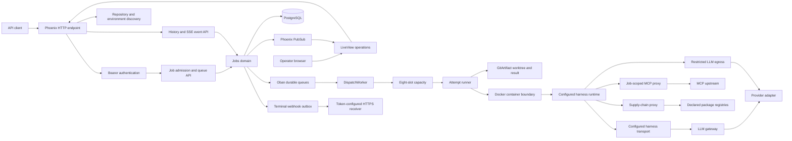

# Architecture

This document describes the current queue-only system. The executable boundary
is a Phoenix/OTP service with a durable job store, a governed attempt runner,
and a small agent image. Declared repositories, environments, credentials,
caches, and host limits come from `omashiki.toml`; admitted jobs retain the
resolved repository and environment snapshots.

## System Shape

## Components

- **HTTP and operator surfaces.** `OmashikiWeb.Router` exposes health and token
  issuance, authenticated repository/environment discovery, job admission and
  lifecycle, result/history reads, SSE, and delivery status. LiveView exposes
  `/`, `/queue`, `/jobs/:id`, and `/config`; it reads the submitting operator's
  jobs and refreshes from PubSub plus a two-second refresh.
- **Admission and state.** `Omashiki.Jobs.Admission` validates the versioned
  contract, resolves declared names, captures redacted snapshots and SHA-256
  digests, and persists the job, first attempt, first event, and dispatch row in
  one transaction. `Omashiki.Jobs` owns transitions, fencing, capacity release,
  retries, parent unlocking, and event creation.
- **Durable dispatch.** `Omashiki.Jobs.DispatchWorker` runs in Oban's
  `scheduler` queue. `Omashiki.Jobs.Recovery` marks expired active leases
  failed and releases capacity. The configured queues are `scheduler: 10` and
  `webhooks: 5`; the database capacity row limits active attempts to eight.
- **Attempt runner.** `Omashiki.Jobs.Runner` records ordered `provision`, pre,
  harness, post, `finalization`, and `cleanup` steps. Commands are argv-only,
  must use declared executables, and reject unsafe executables. Exceptions and
  boundary failures become terminal attempt failures without creating a second
  attempt.
- **Governed runtime.** `Omashiki.Runtime.ContainerManager` talks to Docker
  through its Unix socket, mounts the captured worktree, uses the resolved
  harness launch plan, drops capabilities, disables privilege escalation, uses
  a read-only root filesystem with tmpfs, and removes orphan containers at boot.
  Transport, startup, readiness, and secret targets are adapter metadata. The
  runner converts the provisioned container and injected boundary into a typed
  `Omashiki.Runtime.Capability`; adapters use it for HTTP endpoints or argv-only
  CLI execution without importing Docker code. The Claude Code adapter prepares
  its neutral invocation in a restrictive host temporary file, bind-mounts it
  read-only under the container's `/tmp`, and calls a fixed runner that reads the
  prompt from stdin.
- **Git result boundary.** `Omashiki.Jobs.GitArtifact` creates a job worktree
  from the captured base branch. Finalization rejects symlinks, protected paths,
  likely secrets, and output above 100 MiB; safe changes are committed and the
  result requires a clean worktree plus base and head SHAs. Successful branches
  use the `omashiki/job-<id>` prefix; `GitArtifact.prune_expired/2` provides the
  configured 30-day branch-pruning policy.
- **Data-plane gateways.** The LLM gateway accepts an OpenAI-compatible request
  using a short-lived job claim, checks the captured environment and credential,
  applies budget/circuit policy, and records usage. The tool proxy filters
  declared capabilities and the supply-chain proxy derives registry targets from
  the captured policy. The optional LLM egress proxy permits only configured
  HTTPS hosts on port 443 with public resolved addresses.
- **Observation and delivery.** `JobEvent` rows are append-only per-job
  sequence. SSE accepts `Last-Event-ID`, replays contiguous retained rows, and
  stops after a terminal event. A terminal event and its webhook outbox row are
  committed together; `Webhooks` signs canonical JSON with timestamp-bound
  HMAC-SHA256, retries for 24 hours, and then records a dead-letter status.

## Configuration Boundary

`Omashiki.Config` loads the root `omashiki.toml` at boot and stores a validated
snapshot. Top-level `[harnesses.*]` profiles register the adapter, runtime, and
image; environments reference one profile and own only job policy, mounts,
caches, and lifecycle steps. The resolved profile and adapter launch plan are
included in the immutable environment snapshot and registry digest.

Declared host mounts are read-only except for explicit files below the managed
`/run/omashiki/state` root. That narrow writable boundary supports rotating
OAuth state without exposing a provider's full host configuration directory.

Public job payloads use the neutral V2 shape: required `instruction` plus
optional JSON-object `context`. Harness/provider/auth/model control fields are
not accepted from callers. A restart is required to reload the file.

Authentication is enabled by default in application configuration. The checked-
in TOML sets `auth.enabled = false` for local use; the endpoint still requires
Bearer authentication for non-loopback API peers, and boot rejects unsafe
unauthenticated exposure.

## Code References

- [Router and routes](../server/lib/omashiki_web/router.ex)
- [Application supervision](../server/lib/omashiki/application.ex)
- [V1 job envelope](../server/lib/omashiki/jobs/contract/v1.ex)
- [V2 neutral payload](../server/lib/omashiki/jobs/contract/payload_v2.ex)
- [Admission](../server/lib/omashiki/jobs/admission.ex)
- [Job lifecycle](../server/lib/omashiki/jobs.ex)
- [Attempt runner](../server/lib/omashiki/jobs/runner.ex)
- [Container boundary](../server/lib/omashiki/runtime/container_manager.ex)
- [Harness adapter contract](../server/lib/omashiki/harness/adapter.ex)
- [Harness types](../server/lib/omashiki/harness/types.ex)
- [Runtime capability](../server/lib/omashiki/runtime/capability.ex)
- [OpenCode adapter](../server/lib/omashiki/harness/open_code.ex)
- [Claude Code adapter](../server/lib/omashiki/harness/claude_code.ex)
- [Git artifact boundary](../server/lib/omashiki/jobs/git_artifact.ex)
- [Event stream](../server/lib/omashiki/jobs/event_stream.ex)
- [Webhook delivery](../server/lib/omashiki/jobs/webhooks.ex)
- [Declarative configuration](../omashiki.toml)
- [Configuration loader](../server/lib/omashiki/config.ex)
- [Database schema](../server/priv/repo/migrations/20260101000000_initial_schema.exs)
- [Agent image](../agent/Dockerfile)
- [Claude Code image](../agent/Dockerfile.claude)
