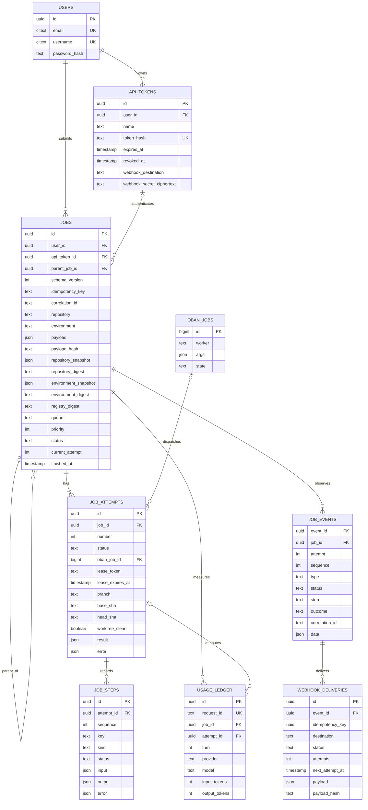

# Data Model

The database stores admitted jobs and durable execution effects. The root
`omashiki.toml` stores the declared repository and environment registry, cache
definitions, credentials, and host limits. Admission copies the resolved
repository and environment into the job, so a later configuration change cannot
change an admitted execution.

## Persisted Tables

| Table | Purpose and important fields |
| --- | --- |
| `users` | Owner identity: `id`, `email`, `username`, Argon2 `password_hash`, timestamps. |
| `api_tokens` | Owner token metadata: `id`, `user_id`, `name`, HMAC `token_hash`, lifecycle timestamps, and encrypted terminal-delivery settings. |
| `jobs` | Immutable admission identity and mutable lifecycle: owner/token, optional `parent_job_id`, schema and idempotency keys, correlation, repository/environment names, neutral V2 payload and hash, captured snapshots and digests, queue/priority, status, attempt number, timestamps, and terminal result/error. |
| `execution_capacity` | Singleton capacity ledger with configured capacity and active reservations. The checked-in configuration sets capacity to 8. |
| `job_attempts` | Numbered attempt state: job, Oban row, runner lease/fence, capacity reservation, timestamps, Git branch/base/head, clean flag, result, and error. |
| `job_steps` | Ordered attempt steps with key, kind, status, input/output summaries, error, and timestamps. |
| `job_events` | Append-only per-job observations with event ID, attempt, sequence, type/status/step/outcome, correlation, occurrence/recording timestamps, sanitized data, and schema version. |
| `webhook_deliveries` | Terminal-event outbox state: destination, event idempotency key, delivery status, retry schedule/count, response/error, canonical payload hash, and encrypted signing material. |
| `usage_ledger` | Append-only provider usage attributed to a job and optionally an attempt: stable request ID, turn, source/provider/model, token counts, provider request ID, and timestamp. |
| `oban_jobs` | Oban's durable dispatch and delivery queue rows. Worker arguments carry job or delivery identifiers; domain ownership remains in the tables above. |

All domain IDs are UUIDs except the Oban identifier and the singleton capacity
ID. JSON fields accept JSON values; event and result data are restricted by the
versioned contract and sanitized at their write boundaries.

## Job Schema

`jobs` is the central record. Admission fields are immutable after insertion:

| Field group | Fields | Rule |
| --- | --- | --- |
| Identity | `id`, `user_id`, `api_token_id`, `parent_job_id`, `schema_version` | The parent and token must belong to the same owner; a job cannot parent itself. |
| Request | `idempotency_key`, `correlation_id`, `repository`, `environment`, `payload`, `payload_hash` | The V1 envelope carries neutral payload V2 (`instruction` plus optional object `context`), no larger than 1 MiB encoded; the payload hash is SHA-256. |
| Captured registry | `repository_snapshot`, `repository_digest`, `environment_snapshot`, `environment_digest`, `registry_digest` | Resolved declarations are retained with SHA-256 digests; credential API keys are excluded from snapshots. |
| Scheduling | `queue`, `priority` | The queue defaults to `default`; priority is an integer from 0 through 3. |
| Lifecycle | `status`, `current_attempt`, `queued_at`, `started_at`, `finished_at` | Status is `blocked`, `queued`, `provisioning`, `running`, `succeeded`, `failed`, or `cancelled`. |
| Terminal state | `terminal_result`, `terminal_error` | Success has a result and no error; failure/cancellation has an error and no result. |

Each admitted job starts with attempt 1. A blocked child has a parent; a queued
root has a dispatch row. A retry changes a failed or cancelled job back to
`queued`, increments `current_attempt`, and inserts the next `job_attempts` row.
The database prevents more than one provisioning/running attempt for a job.

## Attempt, Event, and Delivery Rules

- `job_attempts(job_id, number)` is unique. An active attempt carries a lease
  token, expiry, heartbeat, and reserved capacity; terminal rows clear those
  fields.
- A successful attempt must contain `branch`, `base_sha`, `head_sha`, a true
  `worktree_clean`, and a result. Failed or cancelled attempts contain an error
  and no Git result fields.
- `job_steps(attempt_id, sequence)` and `job_steps(attempt_id, key)` are unique.
  Terminal steps have a finish timestamp; pending/running steps do not.
- `job_events(job_id, sequence)` is unique and `job_events(job_id, attempt)`
  references the numbered attempt. Event type, status, step, and outcome use
  the same terminal vocabulary.
- `webhook_deliveries(event_id, destination)` and
  `(destination, idempotency_key)` are unique. Delivery status is `pending`,
  `delivering`, `delivered`, `failed`, or `dead`.
- `usage_ledger.request_id` is unique. Optional token-count fields remain null
  when the provider does not report them; reported zero is distinct from
  unknown.

## Relationships

The parent, token, and usage relationships include owner checks in SQL where
required. Event and queue references are durable foreign keys; the worker
argument inside `oban_jobs.args` is JSON and is not a relational foreign key.

## Code References

- [Initial schema](../server/priv/repo/migrations/20260101000000_initial_schema.exs)
- [Job schema](../server/lib/omashiki/jobs/job.ex)
- [Attempt schema](../server/lib/omashiki/jobs/job_attempt.ex)
- [Step schema](../server/lib/omashiki/jobs/job_step.ex)
- [Event schema](../server/lib/omashiki/jobs/job_event.ex)
- [Delivery schema](../server/lib/omashiki/jobs/webhook_delivery.ex)
- [Admission](../server/lib/omashiki/jobs/admission.ex)
- [V1 job envelope](../server/lib/omashiki/jobs/contract/v1.ex)
- [V2 neutral payload](../server/lib/omashiki/jobs/contract/payload_v2.ex)
- [Declared configuration](../omashiki.toml)
