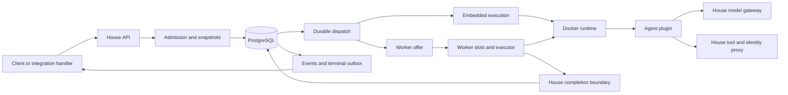

# Architecture

Omashiki separates job admission from execution.
The house owns persistent state and policy.
Execution machines run admitted snapshots in Docker containers.

## Process roles

| Role | Services |
| --- | --- |
| `embedded` | House services and local execution. |
| `manager` | PostgreSQL access, registry, API, delivery, and worker coordination. |
| `worker` | Enrollment, polling, local slots, execution, and completion delivery. |

A worker does not connect to the house database.
Several embedded nodes can instead share one PostgreSQL database.
That deployment uses database capacity rows per machine.

## Components

| Component | Responsibility |
| --- | --- |
| `OmashikiWeb.Router` | Public API, browser views, and separate internal routes. |
| `Omashiki.Config` | Load and validate registry declarations. |
| `Omashiki.Jobs.Admission` | Validate requests and capture immutable execution snapshots. |
| `Omashiki.Jobs` | State transitions, attempt identity, dependencies, and capacity release. |
| `Omashiki.Jobs.DispatchWorker` | Durable dispatch through Oban. |
| `Omashiki.Runtime.AttemptSupervisor` | Independent temporary process for each local active attempt. |
| `Omashiki.Jobs.Runner` | Preparation, agent turn, post-steps, finalization, and cleanup. |
| `Omashiki.Runtime.ContainerManager` | Docker operations through the trusted host socket. |
| `Omashiki.Plugin.Interpreter` | Execute admitted plugin transport and output rules. |
| `Omashiki.Worker.Slots` | Reserve and release worker-local execution slots. |
| `Omashiki.Worker.Poller` | Poll enrolled houses and deliver completions. |
| `Omashiki.Worker.Inbox` | Validate offered work and apply completion results at the house. |
| `Omashiki.Jobs.Webhooks` | Signed terminal notification delivery. |
| `OmashikiWeb.TaskViews` | Load display-only task views from `ui.toml`, separately from the registry. |
| `Omashiki.Runtime.ContainerTracker` | Keep the containers of an executing node from lifecycle events and a census. |
| `Omashiki.Fleet` | Join worker reports and the local tracker into the nodes of the fleet graph. |

The browser provides the Home task views, the System health view, and the configuration view.
The views file changes only the Home screen. Admission, dispatch, and workers do not read it.
Job lifecycle operations remain available through the public API.
The operator dashboard exposes runtime diagnostics under its access checks.

## Admission boundary

Admission validates the V1 envelope and neutral V2 payload.
It resolves repository, environment, preset, plugin, runtime image, and policy declarations.
It stores the admitted definitions and SHA-256 digests.
The job, first attempt, initial event, and dispatch state commit transactionally.

The payload cannot override provider, harness, model, or authentication policy.
Git jobs require a repository and task branch selection.
Non-Git jobs can omit the repository.
Dependencies use explicit edges with per-edge failure policy.

## Runtime boundary

The runner uses a typed runtime capability rather than exposing Docker to plugin adapters.
Slow Docker operations run in monitored tasks.
Independent attempts do not serialize behind one container operation.
HTTP transports use allocated local ports and explicit readiness checks.
CLI transports use argument arrays and invocation files.

The container has a read-only root filesystem and bounded temporary storage.
The runtime drops capabilities and disables privilege escalation.
Only declared mounts, credentials, tools, and network access are supplied.
A private credential copy can contain explicit writable OAuth state.
The original credential directory remains outside the sandbox.

## Data plane

The model gateway checks temporary job claims and admitted credential policy.
It applies budget rules and records provider usage.
The tool proxy checks declared capabilities before forwarding a request.
The identity broker performs GitHub App operations within the house.
The package proxy applies configured registry policy.
Restricted egress checks permitted destinations separately from unrestricted host networking.

Worker, model, tool, package, and egress authorization are different boundaries.
An operator bearer token is not interchangeable with a runtime claim.

## Results and recovery

The Git sink validates and commits output before publication to the canonical remote.
The files sink returns a validated archive and digest to the house.
The none sink returns completion metadata.
A result belongs to the house that offered the job.

Fencing leases prevent stale execution from applying a second completion.
Recovery marks expired attempts failed and releases capacity.
Each attempt has independent supervision.
See [job lifecycle](job-lifecycle.md) and [distributed execution](distributed-execution.md).

## Terminal notifications

Terminal events and configured webhook outbox rows commit together.
Delivery uses canonical JSON and timestamp-bound HMAC-SHA256.
Retries retain the event identity. Receivers must tolerate duplicate delivery.
The delivery window is 24 hours before dead-letter state.

The server integration function is `Omashiki.ApiTokens.configure_webhook/2`.
It configures a token-owned destination and signing material.
There is no public route for this operation.
Use the function from trusted server integration code with the correct token record.

## Source map

- [Application roles](../../server/lib/omashiki/application.ex)
- [Router](../../server/lib/omashiki_web/router.ex)
- [Admission](../../server/lib/omashiki/jobs/admission.ex)
- [Runner](../../server/lib/omashiki/jobs/runner.ex)
- [Runtime capability](../../server/lib/omashiki/runtime/capability.ex)
- [Container manager](../../server/lib/omashiki/runtime/container_manager.ex)
- [Plugin interpreter](../../server/lib/omashiki/plugin/interpreter.ex)
- [Worker modules](../../server/lib/omashiki/worker)
- [API tokens](../../server/lib/omashiki/api_tokens.ex)
