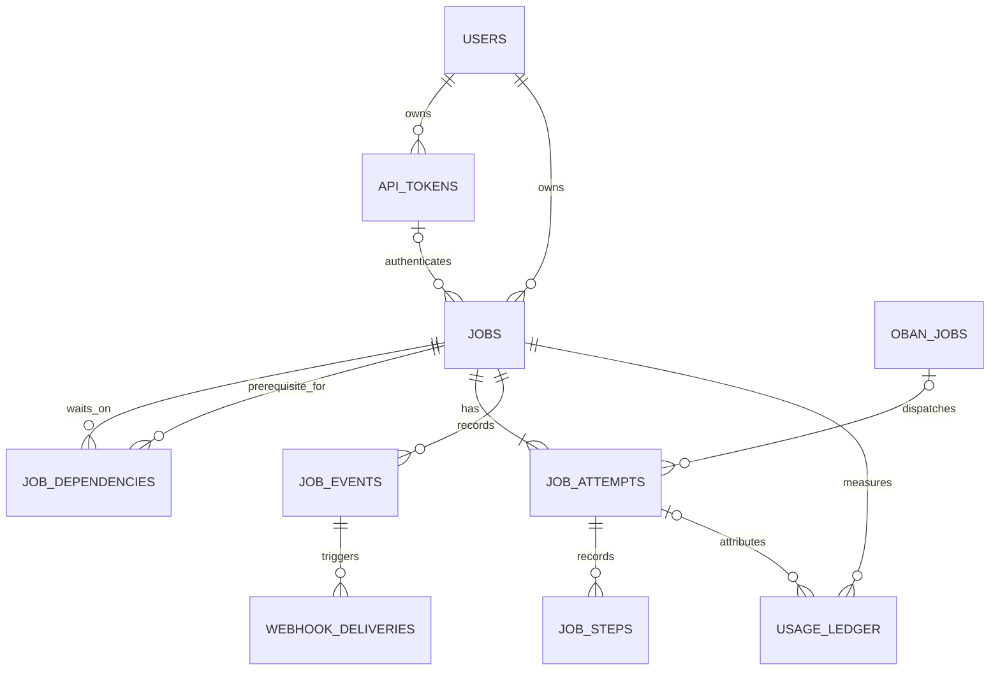

# Data model

PostgreSQL stores jobs and durable execution records.
The registry stores execution declarations in TOML.
Admission captures resolved declarations in each job.

## Tables

| Table | Responsibility |
| --- | --- |
| `users` | Operator identity and password hash. |
| `api_tokens` | Owner, token hash, scopes, allowed environments, active-job limit, expiry, revocation, and encrypted webhook settings. |
| `jobs` | Admitted request, snapshots, digests, lifecycle, and terminal result. |
| `job_dependencies` | Directed prerequisite edges and failure policy. |
| `job_attempts` | Numbered attempts, machine identity, lease, capacity reservation, result, summary, and change stats. |
| `job_steps` | Ordered execution steps with bounded input, output, and error data. |
| `job_events` | Append-only observations with contiguous per-job sequence. |
| `execution_capacity` | Database execution capacity by machine for embedded coordination. |
| `webhook_deliveries` | Terminal outbox and delivery retry state. |
| `usage_ledger` | Append-only usage attributed to a stable request and job. |
| `token_audit_events` | Token actions: submit, cancel, retry, issue, rotate, revoke, redeliver. |
| `oban_jobs` | Durable scheduler and notification work. |

Worker-local slots are separate from database capacity rows.
Remote workers do not mount or connect to the database.
Their enrollment state persists manager IDs, URLs, and worker tokens.

## Job fields

| Group | Fields |
| --- | --- |
| Owner | `user_id`, `api_token_id`. |
| Request | `idempotency_key`, `correlation_id`, `repository`, `environment`, `payload`, `payload_hash`. |
| Repository snapshot | `admitted_repository`, `admitted_repository_digest`. |
| Environment snapshot | `admitted_environment`, `admitted_environment_digest`. |
| Plugin snapshot | `admitted_plugin`, `admitted_plugin_digest`. |
| Registry | `registry_digest`. |
| Scheduling | `queue`, `priority`, `dependency_artifacts`. |
| Lifecycle | `status`, `current_attempt`, `queued_at`, `started_at`, `finished_at`. |
| Terminal record | `terminal_result`, `terminal_error`. |

The database protects admitted identity fields from later updates.
A non-Git job can have a null repository and repository snapshot.
The environment and plugin snapshots remain required.
Credential API keys and private identity keys do not belong in admitted snapshots.

The current model uses `job_dependencies`, not `parent_job_id`.
Each edge stores `job_id`, `depends_on_job_id`, `user_id`, and `on_failure`.
The database checks ownership, uniqueness, and self-reference constraints.
Admission also checks the dependency graph.

## Relationships

## Invariants

`job_attempts(job_id, number)` is unique.
Only one attempt for a job can be provisioning or running.
An active attempt has a lease and a capacity reservation.
Terminal transitions clear active lease and reservation state.

Git success requires branch, base SHA, head SHA, clean-worktree status, and result metadata.
Non-Git success uses sink-specific metadata without required Git fields.
Failure or cancellation records an error.

Step sequence and step key are unique within an attempt.
Event sequence is unique within a job.
Events reference the relevant numbered attempt.

A delivery is unique for its event and destination.
Delivery states are `pending`, `delivering`, `delivered`, `failed`, and `dead`.
The usage ledger's stable request ID prevents duplicate accounting.
A null token count means unknown. It is different from zero.

## Migration history

The initial schema does not represent the complete current model.
Later migrations add per-machine capacity, admitted plugin snapshots, non-Git results, and dependency edges.
The [migration directory](../../server/priv/repo/migrations) is the complete schema history.

Source schemas: [job](../../server/lib/omashiki/jobs/job.ex),
[dependency](../../server/lib/omashiki/jobs/job_dependency.ex),
[attempt](../../server/lib/omashiki/jobs/job_attempt.ex), and
[event](../../server/lib/omashiki/jobs/job_event.ex).
