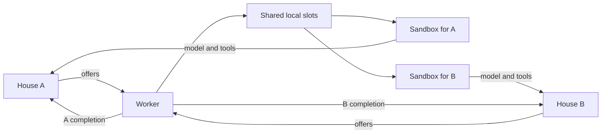

# Distributed execution

The manager owns admission, policy, and durable job state.
The worker executes offers without database access.
Both roles use the same release.

## Topology

One manager can serve several workers.
One worker can serve several managers.
Each manager is an independent house with its own database and registry.
The worker identifies a house by its enrollment ID and connection settings.

## Enrollment

The worker listener accepts an enrollment secret.
`POST /internal/enroll` adds or replaces a manager entry.
`GET /internal/enroll` returns IDs and URLs without token values.
`DELETE /internal/enroll/<id>` removes one entry.
The worker persists its enrollment state across restart.

`worker.toml` contains machine limits and Docker settings.
It does not contain the house registry, identity keys, or provider API keys.
Credential path declarations arrive through the admitted environment.
The worker resolves permitted host credential origins on its own machine.

## Work protocol

| Endpoint | Responsibility |
| --- | --- |
| `POST /internal/work/register` | Register worker presence with a manager. |
| `POST /internal/work/poll` | Request available work. |
| `POST /internal/work/report` | Send free slots, capacity, and this house's containers. |
| `POST /internal/work/accept` | Accept an offer under worker capacity. |
| `POST /internal/work/reject` | Refuse an unusable offer. |
| `POST /internal/work/heartbeat` | Renew active execution information. |
| `POST /internal/work/complete` | Return a fenced terminal completion. |
| `PUT /internal/work/blobs/{job_id}` | Upload a file result before completion. |

Worker authentication is separate from operator API authentication.
Offers carry admitted snapshots and the data-plane connection for that house.
The worker checks the offer before it executes the job.
A missing image or invalid snapshot must not produce successful execution.

## Capacity and leases

`Omashiki.Worker.Slots` is the local authority for a worker's capacity.
The limit applies across all enrolled houses.
The poller visits enrolled houses in round-robin order.
Presence is per house and includes available capacity.
The documented stale threshold is thirty seconds without a poll.

## Fleet reports

`Omashiki.Runtime.ContainerTracker` keeps the containers of each executing node.
`ContainerManager` publishes created, started, and removed events after each Docker call.
A census every ten seconds corrects the list.
The worker sends a report after each container change and every five seconds.
A report to a house contains only containers of that house's in-flight attempts.
The manager validates the report and records it with the worker presence.
The report does not change a job, a lease, or capacity.

Manager leases and worker slot ownership prevent duplicate acceptance and completion.
A stale completion cannot replace the result of a later attempt.
A failed manager connection does not remove another house's work.

## Results

| Sink | Worker action | Manager action |
| --- | --- | --- |
| `git` | Validate and publish to the captured remote. | Record branch and revision metadata. |
| `files` | Create and upload the validated archive. | Verify its digest and store the result. |
| `none` | Return completion metadata. | Record the terminal result. |

A files completion cannot refer only to a worker-local path.
The manager must have the blob before it accepts success.
Mirrors, job state, and completion destinations remain separated by manager ID.
The worker must not infer a different remote or destination from live local configuration.

## Data plane access

The worker and its containers must reach the offering manager.
A job uses that house for model gateway, tool proxy, and identity broker access.
The container receives temporary claims rather than the house's provider keys.
A loopback manager URL is unsuitable for remote or separate-container access.

## Verification

`e2e:host-worker` checks separate host processes.
`e2e:compose-worker` checks release images and HTTP enrollment.
`e2e:two-houses` checks shared slots, separate results, and independent manager recovery.
VM tests check the distributed runtime in disposable machines.
See [the distributed test procedure](how-to-run-distributed-tests.md).
