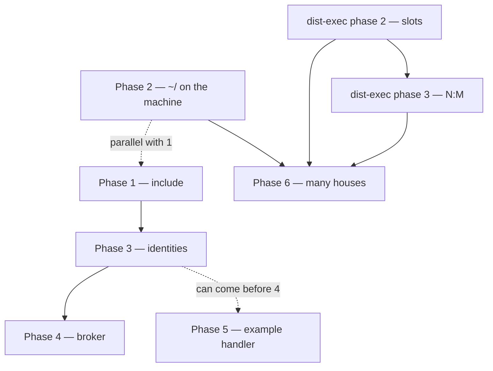

# Houses and fleet: implementation record

This is **how** we reached the product described in [docs/concepts/](../README.md).
It was written as a plan when the product was still a target. It stays as an
engineering record, with a closing note for each phase.

- [docs/concepts/](../README.md) is the **product**. This file is the **work order** that produced it.
- [distributed-execution.md](distributed-execution.md) owns the manager/worker protocol. We did not plan it again here. Phases 2 and 3 of that document are a **dependency track** (the fleet), not new work in this plan.
- **Today vs target** is named honestly: what already runs vs what did not exist yet.
- **Status (2026-09-06):** the six phases are merged in `master`. Each phase has its closing note below. What stayed out is in "Known gaps" at the end.

---

## Already running before this plan (not reimplemented)

| Area | What existed |
| --- | --- |
| **Admission** | `POST /api/v1/jobs`: the client selects the **name** of the environment; the payload is only `instruction` + `context`; no harness, provider, model, or auth in the payload |
| **Snapshots** | `admitted_environment` / `admitted_repository` / `admitted_plugin` + digests; the worker runs the snapshot, not the live registry |
| **Boot** | Roles `embedded` / `manager` / `worker`; `worker.toml` = limits + Docker; `Config.reset!()` on the worker |
| **Gateway** | LLM keys in the house; job token in the container |
| **Host credentials** | Copy per attempt to `/run/omashiki/state` (single node) |
| **Webhooks** | Terminal outbox; a handler can subscribe as a client |
| **Dist-exec** | Protocol poll/offer/accept/heartbeat/complete, enroll, N:1 poll scaffolding |

---

## Two tracks, one product

| Track | Owner | Document |
| --- | --- | --- |
| **House** | product registry, identities, `include`, broker | **this file** |
| **Fleet** | slots, N:M isolation, protocol hardening | [distributed-execution.md](distributed-execution.md) phases 2–3 |

Phases 1–2 of **this** file could start while fleet phases 2–3 were open. Phase 6 (many houses as a product) **waits** for fleet phases 2–3.

---

## Work order

| Phase | Depends on |
| --- | --- |
| 1 include | — |
| 2 `~/` on the machine | — (parallel with 1) |
| 3 identities | 1 |
| 4 broker | 3 + gateway data plane (already existed) |
| 5 example handler | jobs API (already existed); better after 3 |
| 6 many houses | dist-exec 2–3 + phase 2 (subscription on the machine) |

---

## Phase 1: `include` (optional split)

**Goal.** The house can be one file **or** several. The united snapshot is the same.

**Why now.** Everything after this (`identities/` files, agent profiles) needs this loader. Without `include`, the behavior is the same as before.

**Changes.**

| Rule | Detail |
| --- | --- |
| Where | `include` only in the root `omashiki.toml` |
| Depth | 1: pieces do not include pieces |
| Paths | Only inside the house directory (no URL, no escape) |
| Form | File or directory (`identities/` loads `*.toml`) |
| Union | Same name in two places → **boot fails** (no overlay) |
| Stays in the root | `[app]` `[db]` `[auth]` `[reload]` `[runtimes]` `[limits]` `[nodes]` + the `include` list (`runtime.exs` still reads **this** file before `Config.load!`) |
| Splittable | `identities`, `presets`, `environments`, `credentials`, `host_credentials`, `repositories`, `caches` |
| Digest | Of the **united** snapshot |
| Loadtest | The fragment becomes an `include` (no more `cat >>`) |

**Seams.**

| Path | Role |
| --- | --- |
| `server/lib/omashiki/config.ex` | Orchestration of the united load |
| `server/lib/omashiki/config/include.ex` | Include loader (new) |
| `server/test/omashiki/config/` | Tests next to the existing ones |

**Done when.**

- A house with only `omashiki.toml` boots.
- A house with `include` of `identities/` + `presets/` produces the **same digest** as the equivalent single file.
- A collision of `[presets.x]` in two files → `Config.Error`.
- A path outside the house directory → boot fails.
- Reload stays atomic (a failed include leaves the previous generation).

**Out of this phase.** The `identities` table itself (phase 3); changing `runtime.exs` to read fragments.

**Closed.** `feat(config): split omashiki.toml with include`: `server/lib/omashiki/config/include.ex`, tests in `test/omashiki/config/include_test.exs`. The loadtest fragment is still pasted by hand (loadtest README); it becomes an `include` when somebody touches that flow.

---

## Phase 2: `~/` expands on the machine that runs Docker

**Goal.** The subscription login of the harness belongs to the **machine**, with different Unix users.

**Why after / parallel with 1.** Independent of `include`; unblocks remote Claude/Codex without a matching `/home/<user>`.

**Changes.**

| Rule | Detail |
| --- | --- |
| TOML | Keeps the declared form (`~/.claude/.credentials.json`) |
| House load | **Do not** expand `~/` in `HostCredential.origin!` |
| Snapshot | Carries the form with the tilde (stable digest across nodes) |
| Materialize | `HostCredentials.materialize/3` expands `~/` to the home of **this** process (embedded manager **or** worker) |
| Absolute | Still allowed; do not cross users |
| Relative | Reject `./` and `../` at load |
| worker.toml | Still **without** credentials |
| Missing file | The attempt fails with `host_credential_unavailable`; no search in another place |
| OAuth write-back | **Out**: explicitly undecided |

**Seams.**

| Path | Role |
| --- | --- |
| `server/lib/omashiki/config/host_credential.ex` | Parse without expanding `~/` |
| `server/lib/omashiki/runtime/host_credentials.ex` | Expansion at materialize |
| `server/lib/omashiki/jobs/admission.ex` | `snapshot_value` with unexpanded string paths |
| `server/lib/omashiki/worker/offer.ex` | Paths as strings (now unexpanded) |
| `server/test/omashiki/config/host_credential_test.exs` | Load tests |
| `server/test/omashiki/runtime/` | Materialize tests |

**Done when.**

- Loading `credentials = "~/.claude/.credentials.json"` keeps that string.
- A worker with home `/home/ubuntu` copies `/home/ubuntu/.claude/.credentials.json`.
- A worker without the file → the attempt fails.
- Single-node embedded still works with the `~` of the operator.

**Out of this phase.** Sending the **bytes** of the file from the house to the worker (not the chosen design: login on the machine, not the developer travelling).

**Closed.** `feat(runtime): expand ~/ credentials on the copying host`. The expansion uses the `HOME` of the process (the release and Compose set it per process) with a fallback to the home of the VM.

---

## Phase 3: identities in the registry (declare, do not act)

**Goal.** The agent has a face in the TOML of the house. A GitHub App is a **kind** of identity, not a kind of work.

**Why after 1.** So that `identities/review-bot.toml` can exist. Relation with 2: none; can overlap, but 3 is product shape.

**Changes.**

| Rule | Detail |
| --- | --- |
| Table | `[identities.<name>]` |
| First kind | `github-app`: `app_id`, `installation_id`, `private_key` (`${env:VAR}` only; boot fails if unset, like other secrets) |
| Presets | `presets.*.identities = ["review-bot", ...]` zero or more; unknown name → boot fails |
| Environment | Does **not** get an `identities` field |
| Snapshot / admission | Names + kind + public ids; **never** `private_key` in the row, the offer, the sandbox, or the worker |
| Payload | Unchanged |
| Worker | Never receives the identities table |
| Without | A `[github]` section; issue or event keys |

**Seams.**

| Path | Role |
| --- | --- |
| `server/lib/omashiki/config/identity.ex` | New struct + parse |
| `server/lib/omashiki/presets.ex` | `@preset_fields` + `identities` |
| `server/lib/omashiki/config.ex` | Wire into the snapshot |
| `server/lib/omashiki/config/registry.ex` | United registry |
| `server/lib/omashiki/jobs/admission.ex` | `snapshot_value`: strip `private_key` like `api_key` |
| `server/test/omashiki/config/` | Load and collision tests |

**Done when.**

- The product example of `review-bot` + `presets.reviewer` loads.
- Two presets can list the same identity.
- `private_key` is not in `admitted_environment` nor in the worker offer.
- An unknown identity name → boot fails.
- A house with zero identities loads.

**Out of this phase.** Commenting on GitHub, minting installation tokens, GitHub MCP tools (phase 4).

**Closed.** `feat(config): declare agent identities on presets`: `config/identity.ex`; the preset keeps the public view, the key only in `Config.identities/0`.

---

## Phase 4: the house acts as the App (form B)

**Goal.** While the job runs, the sandbox asks the **house**; the house uses `review-bot` to comment, label, or open a PR. The sandbox and the machine never see the private key.

**Why after 3.** Nothing to wear before it is declared. The **gateway data plane** already existed: the same pattern as the LLM keys.

**Changes.**

| Rule | Detail |
| --- | --- |
| Broker | On the manager, bound to the admitted identity names (preset captured at admission) |
| Sandbox | Talks to the owner house (data plane / generic MCP pipe: `url` + `headers` on the environment). The **name** is still `[identities.review-bot]` |
| Reach | A worker that cannot reach the house → refuses the job (data-plane rule already existed) |
| Handler | The client at the door is **not** this |

**Seams.**

| Path | Role |
| --- | --- |
| `server/lib/omashiki/identities/` | Broker (new) |
| Claims | Binding like the gateway |
| GitHub App client | On the manager (tools proxy or dedicated client) |
| Router | Only on the manager, not on the worker |

**Done when.**

- A job whose preset lists `review-bot` causes a GitHub comment **from the house process**.
- Worker logs and disk have no `private_key`.
- A job without identities in the preset does not call the broker.

**Out of this phase.** Inbound GitHub webhooks (phase 5); Jira as identity (Jira stays MCP on the environment).

**Closed with gaps.** `feat(identities): act as the agent's GitHub App from the house`: `identities/broker.ex` answers as an in-process MCP server on the tools proxy; `identities/github_app.ex` signs the JWT and caches the installation token. Proved against a simulated GitHub (Bypass) with the JWT verified by the public key, **not** against a real GitHub. Only the opencode harness receives the MCP configuration that lists the identity.

---

## Phase 5: example handler (form A), outside the core

**Goal.** GitHub or Jira as a **client at the door**. Not a feature table of Omashiki.

**Why after 3** (so the house can already have an identity if form B also exists); can ship after 3 even without phase 4.

**Changes.**

| Piece | Detail |
| --- | --- |
| `examples/handler/` | Receives the GitHub webhook, verifies the secret, `POST /api/v1/jobs` with `instruction` + `context`, the environment name, **no** GitHub in the payload |
| Terminal webhook | Uses the existing outbox to hear the end of the job |
| Documentation | Webhook secret and event mapping **in the handler**, never in `omashiki.toml` |
| Core | No new GitHub schema; maybe a pointer in the README |

**Seams.**

| Path | Role |
| --- | --- |
| `examples/handler/` | Runnable sketch |
| `docs/concepts/client-at-the-door.md` | Describes the model |
| `server/lib/omashiki/jobs/webhooks.ex` | Delivery already existed |

**Done when.**

- An operator runs the example against a house, labels an issue, sees a job admitted with environment `triage`, and receives the completion notice, **without** `[github]` in the TOML of the house.

**Out of this phase.** A GitHub App product inside Omashiki.

**Closed.** `feat(examples): add GitHub issue handler at the door`: `examples/handler/github_issue_handler.py`, stdlib only, with unit and socket tests. It was not run against a real house with a real issue; the contract of the two webhooks is covered by tests.

---

## Phase 6: many houses, the same machines (product, not protocol)

**Goal.** The target sentence: *"my developers each have their own Omashiki, and I lend them machines"*.

**Depends on** [distributed-execution.md](distributed-execution.md):

- **Phase 2 (fleet):** the slots on the worker are the capacity authority; the manager records in-flight; two managers do not over-reserve.
- **Phase 3 (fleet):** jobs of A and B do not cross remotes, blobs, or claims.

We do not copy the task list of that document. We only cite the dependency.

**Operator product** (this phase):

| Piece | Detail |
| --- | --- |
| Enroll / tokens | Which houses a machine can serve: a documented procedure, not only env vars |
| Presence | Workers as liveness machine → this house (not a cluster control plane) |
| Proof | House A + house B, one machine, two jobs, no crossed remotes, no crossed credentials, results only in the owner house |

**Seams.**

| Path | Role |
| --- | --- |
| `server/lib/omashiki/worker/managers.ex` | List of managers |
| `server/lib/omashiki/worker/presence.ex` | Liveness |
| Overview LiveView | Presence UI |
| `examples/compose*.yml` | Multi-house Compose |
| Enroll scripts | Extend, do not replace the protocol |

**Done when.**

- Two real manager processes + one worker, documented in `examples/`, isolation holds through kill/restart of one house.

**Out of this phase.** A developer selecting GPU-1; an org-wide App sending to two houses; one Omashiki with many developer logins (another product).

**Closed.** `feat(worker): enroll one machine into many houses` + `test(e2e): prove two houses share one worker in isolation`: `mise run e2e:two-houses`. Finding: two houses on the same **host** collide on the supply-chain socket; each needs its own `OMASHIKI_SUPPLY_CHAIN_SOCKET_PATH` (not an issue under Compose).

---

## Explicitly never in this plan

- A `[github]` section, issue filters, or the webhook secret in `omashiki.toml`
- Identity on the environment or in the job payload
- `host_credentials` in `worker.toml`
- `include` chains or merge by overlay
- Relative credential paths without `~`
- Mounting the `~/.claude` of a developer on a machine
- Sending the bytes of a subscription file from the house to the worker as a design
- OAuth write-back (undecided)
- Kata / Arch / judge / fan-in (other documents)
- Changing who selects the environment (it is already the submitter)

---

## Known gaps

| Gap | Where | What is missing |
| --- | --- | --- |
| Real GitHub | phase 4 | A comment on a real issue with a real App; the broker was proved only against a simulated GitHub |
| Identity on the other harnesses | phase 4 | The MCP configuration render (`Tools.McpConfig`) is called only for opencode; Claude and jcode do not see the identity server |
| Loadtest by `include` | phase 1 | The loadtest README still says to paste the fragment; the loader already supports `include` |
| Handler against a real house | phase 5 | Tests only; run the example against a house and a labelled issue |

## How we know a phase is done

Each phase closes with:

1. **Tests** at the seams named above.
2. **A note** of one line in this file **or** a comment on the matching promise in [guarantees.md](../concepts/guarantees.md) saying that code exists.

**Do not** mark a promise as "today" until the phase is merged.

| Phase | Promises in guarantees.md |
| --- | --- |
| 1 | 13, 14 |
| 2 | 16 |
| 3 | 9, 10, 17 |
| 4 | 9, 10 |
| 5 | 11, 12 |
| 6 | 1–8, 12 |
