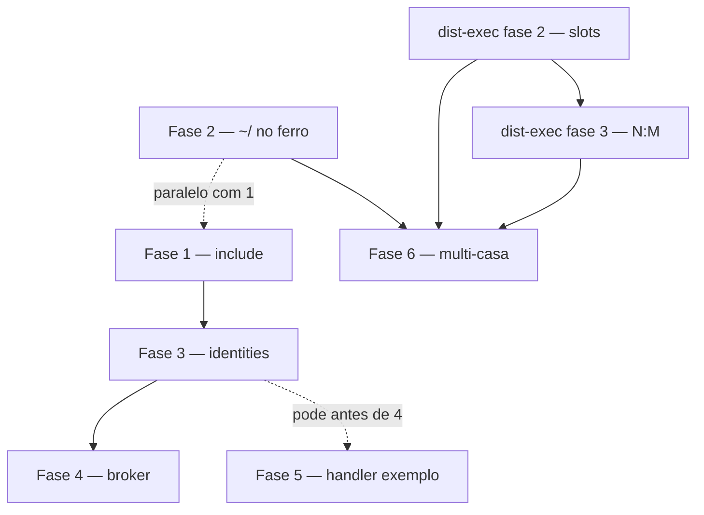

# Omashiki to-be — plano de implementação

Isto é **como** chegamos a [omashiki-to-be.md](../omashiki-to-be.md).

- [omashiki-to-be.md](../omashiki-to-be.md) é o **produto**. Este ficheiro é a **ordem de trabalho**.
- [distributed-execution.md](distributed-execution.md) já é dono do protocolo manager/worker. Não o replaneamos aqui. As fases 2 e 3 daquele doc são uma **pista de dependência** (ferro), não greenfield neste plano.
- **Hoje vs to-be** é nomeado com honestidade: o que já corre em produção vs o que ainda não existe.
- **Estado (2026-09-06):** as seis fases estão merged em `master`; cada fase tem abaixo a sua nota de fecho. O que ficou de fora está em «Lacunas conhecidas» no fim.

---

## Já corre hoje (não reimplementar)

| Área | O que já existe |
| --- | --- |
| **Admissão** | `POST /api/v1/jobs`: o cliente escolhe o **nome** do environment; payload só `instruction` + `context`; sem harness/provider/model/auth no payload |
| **Snapshots** | `admitted_environment` / `admitted_repository` / `admitted_plugin` + digests; o worker executa o snapshot, não o registry vivo |
| **Boot** | Papéis `embedded` / `manager` / `worker`; `worker.toml` = limites + Docker; `Config.reset!()` no worker |
| **Gateway** | Chaves LLM na casa; job token no contentor |
| **Host credentials** | Cópia por tentativa para `/run/omashiki/state` (single-node) |
| **Webhooks** | Outbox terminal; um handler pode subscrever como cliente |
| **Dist-exec** | Protocolo poll/offer/accept/heartbeat/complete, enroll, scaffolding N:1 poll |

---

## Duas pistas, um produto

| Pista | Dono | Doc |
| --- | --- | --- |
| **Casa** | registry de produto, identidades, `include`, broker | **este ficheiro** |
| **Ferro** | slots, isolamento N:M, endurecimento do protocolo | [distributed-execution.md](distributed-execution.md) fases 2–3 |

As fases 1–2 **deste** ficheiro podem começar enquanto ferro 2–3 ainda estão abertas. A fase 6 (multi-casa como produto) **espera** por ferro 2–3.

---

## Ordem de trabalho

| Fase | Depende de |
| --- | --- |
| 1 include | — |
| 2 `~/` ferro | — (paralelo com 1) |
| 3 identities | 1 |
| 4 broker | 3 + gateway data-plane (já existe) |
| 5 handler exemplo | API jobs (já existe); melhor após 3 |
| 6 multi-casa | dist-exec 2–3 + fase 2 (subscrição no ferro) |

---

## Fase 1 — `include` (split opcional)

**Objetivo.** A casa pode ficar num só ficheiro **ou** partir-se. O snapshot unido é o mesmo.

**Porque agora.** Tudo o que vem a seguir (ficheiros `identities/`, perfis de agente) precisa deste loader. Sem `include`, comportamento igual ao de hoje.

**Mudanças.**

| Regra | Detalhe |
| --- | --- |
| Onde | `include` só na raiz `omashiki.toml` |
| Profundidade | 1 — peças não incluem peças |
| Paths | Só dentro do diretório da casa (sem URL, sem escape) |
| Forma | Ficheiro ou diretório (`identities/` carrega `*.toml`) |
| União | Mesmo nome em dois sítios → **falha boot** (sem overlay) |
| Fica na raiz | `[app]` `[db]` `[auth]` `[reload]` `[runtimes]` `[limits]` `[nodes]` + lista `include` (`runtime.exs` continua a ler **este** ficheiro antes de `Config.load!`) |
| Partível | `identities`, `presets`, `environments`, `credentials`, `host_credentials`, `repositories`, `caches` |
| Digest | Do snapshot **unido** |
| Loadtest | O fragmento passa a ser um `include` (acabar com `cat >>`) |

**Costuras.**

| Caminho | Papel |
| --- | --- |
| `server/lib/omashiki/config.ex` | Orquestração do load unido |
| `server/lib/omashiki/config/include.ex` | Loader de includes (novo) |
| `server/test/omashiki/config/` | Testes ao lado dos existentes |

**Feito quando.**

- Casa só com `omashiki.toml` arranca.
- Casa com `include` de `identities/` + `presets/` produz o **mesmo digest** que o monólito equivalente.
- Colisão de `[presets.x]` em dois ficheiros → `Config.Error`.
- Path fora do diretório da casa → falha boot.
- Reload continua atómico (include falhado deixa a geração anterior).

**Fora desta fase.** Tabela `identities` em si (fase 3); mudar `runtime.exs` para ler fragmentos.

**Fechada.** `feat(config): split omashiki.toml with include` — `server/lib/omashiki/config/include.ex`, testes em `test/omashiki/config/include_test.exs`. O fragmento do loadtest continua a ser colado à mão (README do loadtest); passa a `include` quando alguém tocar nesse fluxo.

---

## Fase 2 — `~/` expande na máquina que corre o Docker

**Objetivo.** O login de subscrição do harness é **do ferro**, com utilizadores Unix diferentes.

**Porque depois / em paralelo com 1.** Independente de `include`; desbloqueia Claude/Codex remoto sem depender de `/home/howl` coincidente.

**Mudanças.**

| Regra | Detalhe |
| --- | --- |
| TOML | Guarda a forma declarada (`~/.claude/.credentials.json`) |
| Load da casa | **Não** expandir `~/` em `HostCredential.origin!` |
| Snapshot | Leva a forma com tilde (digest estável entre nós) |
| Materialize | `HostCredentials.materialize/3` expande `~/` para o home **deste** processo (manager embedded **ou** worker) |
| Absolutos | Ainda permitidos; não cruzam utilizadores |
| Relativos | Rejeitar `./` e `../` no load |
| worker.toml | Continua **sem** credentials |
| Ficheiro em falta | Tentativa falha `host_credential_unavailable`; sem procurar noutro sítio |
| OAuth write-back | **Fora** — explicitamente indeterminado no to-be |

**Costuras.**

| Caminho | Papel |
| --- | --- |
| `server/lib/omashiki/config/host_credential.ex` | Parse sem expandir `~/` |
| `server/lib/omashiki/runtime/host_credentials.ex` | Expansão no materialize |
| `server/lib/omashiki/jobs/admission.ex` | `snapshot_value` com paths em string não expandida |
| `server/lib/omashiki/worker/offer.ex` | Paths como strings (agora sem expandir) |
| `server/test/omashiki/config/host_credential_test.exs` | Testes de load |
| `server/test/omashiki/runtime/` | Testes de materialize |

**Feito quando.**

- Load de `credentials = "~/.claude/.credentials.json"` guarda essa string.
- Worker com home `/home/ubuntu` copia `/home/ubuntu/.claude/.credentials.json`.
- Worker sem o ficheiro → tentativa falha.
- Single-node embedded continua a funcionar com o `~` do operador.

**Fora desta fase.** Enviar **bytes** do ficheiro da casa para o worker (não é o desenho fechado — login no ferro, não a Ana a viajar).

**Fechada.** `feat(runtime): expand ~/ credentials on the copying host`. A expansão usa `HOME` do processo (o release e o Compose definem-no por processo) com fallback ao home da VM.

---

## Fase 3 — identities no registry (declarar, não agir)

**Objetivo.** O agente tem cara no TOML da casa. GitHub App é um **tipo** de identity, não um tipo de trabalho.

**Porque depois de 1.** Para existir `identities/ana-bot.toml`. Relação com 2: nenhuma; pode sobrepor-se, mas 3 é forma de produto.

**Mudanças.**

| Regra | Detalhe |
| --- | --- |
| Tabela | `[identities.<name>]` |
| Primeiro kind | `github-app`: `app_id`, `installation_id`, `private_key` (`${env:VAR}` só; falha boot se unset, como outros segredos) |
| Presets | `presets.*.identities = ["ana-bot", ...]` zero ou mais; nome desconhecido → falha boot |
| Environment | **Não** ganha campo `identities` |
| Snapshot / admissão | Nomes + kind + ids públicos; **nunca** `private_key` na row, offer, sandbox ou worker |
| Payload | Inalterado |
| Worker | Nunca recebe a tabela identities |
| Sem | Secção `[github]`; sem chaves issue/event |

**Costuras.**

| Caminho | Papel |
| --- | --- |
| `server/lib/omashiki/config/identity.ex` | Novo struct + parse |
| `server/lib/omashiki/presets.ex` | `@preset_fields` + `identities` |
| `server/lib/omashiki/config.ex` | Wire no snapshot |
| `server/lib/omashiki/config/registry.ex` | Registry unido |
| `server/lib/omashiki/jobs/admission.ex` | `snapshot_value` — strip `private_key` como `api_key` |
| `server/test/omashiki/config/` | Testes de load e colisão |

**Feito quando.**

- Exemplo to-be de `ana-bot` + `presets.reviewer` carrega.
- Dois presets podem listar a mesma identity.
- `private_key` não está em `admitted_environment` nem no offer do worker.
- Nome de identity desconhecido → falha boot.
- Casa com zero identities carrega.

**Fora desta fase.** Comentar no GitHub, mint de installation tokens, ferramentas MCP GitHub (fase 4).

**Fechada.** `feat(config): declare agent identities on presets` — `config/identity.ex`; o preset guarda a vista pública, a chave só em `Config.identities/0`.

---

## Fase 4 — a casa age como a App (forma B)

**Objetivo.** Enquanto o job corre, a sandbox pergunta à **casa**; a casa usa `ana-bot` para comentar/etiquetar/abrir PR. Sandbox e VPS nunca veem a chave privada.

**Porque depois de 3.** Nada para vestir até estar declarado. **Gateway data-plane** já existe — mesmo padrão das chaves LLM.

**Mudanças.**

| Regra | Detalhe |
| --- | --- |
| Broker | No manager, ligado aos nomes de identity admitidos (preset capturado na admissão) |
| Sandbox | Fala com a casa dona (data-plane / pipe MCP genérico — `url`+`headers` no environment). O **nome** continua `[identities.ana-bot]` |
| Alcance | Worker sem reach à casa → recusa o job (regra data-plane já existe) |
| Handler | Cliente à porta **não** é isto |

**Costuras.**

| Caminho | Papel |
| --- | --- |
| `server/lib/omashiki/identities/` | Broker (novo) |
| Claims | Binding como no gateway |
| Cliente GitHub App | No manager (tools proxy ou cliente dedicado) |
| Router | Só no manager, não no worker |

**Feito quando.**

- Job cujo preset lista `ana-bot` provoca comentário GitHub **do processo da casa**.
- Logs/disco do worker sem `private_key`.
- Job sem identities no preset não chama o broker.

**Fora desta fase.** Webhooks GitHub inbound (fase 5); Jira como identity (Jira fica MCP no environment).

**Fechada com lacunas.** `feat(identities): act as the agent's GitHub App from the house` — `identities/broker.ex` responde como servidor MCP in-process no tools-proxy; `identities/github_app.ex` assina o JWT e cacheia o token de instalação. Provado contra um GitHub simulado (Bypass) com JWT verificado pela chave pública, **não** contra GitHub real. Só o harness opencode recebe a configuração MCP que lista a identity.

---

## Fase 5 — handler exemplo (forma A), fora do core

**Objetivo.** GitHub/Jira como **cliente à porta**. Não é tabela de features do Omashiki.

**Porque depois de 3** (para a casa já poder ter identity se a forma B também existir); pode sair após 3 mesmo sem fase 4.

**Mudanças.**

| Peça | Detalhe |
| --- | --- |
| `examples/handler/` | Recebe webhook GitHub, verifica segredo, `POST /api/v1/jobs` com `instruction`+`context`, nome do environment, **sem** GitHub no payload |
| Terminal webhook | Usa o outbox existente para ouvir fim do job |
| Documentação | Segredo webhook e mapeamento de eventos **no handler**, nunca em `omashiki.toml` |
| Core | Sem schema GitHub novo; talvez ponteiro no README |

**Costuras.**

| Caminho | Papel |
| --- | --- |
| `examples/handler/` | Sketch operável |
| `docs/omashiki-to-be.md` | Já descreve o modelo |
| `server/lib/omashiki/jobs/webhooks.ex` | Entrega já existe |

**Feito quando.**

- Operador corre o exemplo contra uma casa, etiqueta uma issue, vê job admitido com environment `triagem`, e recebe aviso de conclusão — **sem** `[github]` no TOML da casa.

**Fora desta fase.** Produto GitHub App dentro do Omashiki.

**Fechada.** `feat(examples): add GitHub issue handler at the door` — `examples/handler/github_issue_handler.py`, só stdlib, com testes unitários e de socket. Não foi corrido contra uma casa real com uma issue real; o contrato dos dois webhooks está coberto por testes.

---

## Fase 6 — muitas casas, mesmas máquinas (produto, não protocolo)

**Objetivo.** A frase to-be: *«os meus devs têm cada um o seu Omashiki, e eu empresto-lhes ferro»*.

**Depende de** [distributed-execution.md](distributed-execution.md):

- **Fase 2 (ferro):** slots no worker são autoridade de capacidade; manager regista in-flight; dois managers não sobreservam.
- **Fase 3 (ferro):** jobs de A e B não cruzam remotes/blobs/claims.

Não copiamos a lista de tarefas daquele doc — só citamos a dependência.

**Produto de operador** (esta fase):

| Peça | Detalhe |
| --- | --- |
| Enroll / tokens | Quais casas uma máquina pode servir — procedimento documentado, não só env vars |
| Presença | Workers como vivacidade máquina→esta casa (não control plane de cluster) |
| Prova | Casa da Ana + casa do João, um VPS, dois jobs, sem remotes cruzados, sem credentials cruzadas, resultados só na casa dona |

**Costuras.**

| Caminho | Papel |
| --- | --- |
| `server/lib/omashiki/worker/managers.ex` | Lista de managers |
| `server/lib/omashiki/worker/presence.ex` | Liveness |
| Overview LiveView | UI de presença |
| `examples/compose*.yml` | Compose multi-casa |
| Scripts enroll | Estender, não substituir protocolo |

**Feito quando.**

- Dois processos manager reais + um worker, documentado em `examples/`, isolamento mantém-se com kill/restart de uma casa.

**Fora desta fase.** Ana a escolher GPU-1; App org-wide a despejar em duas casas; um Omashiki com muitos logins de developer (outro produto — o to-be diz-o).

**Fechada.** `feat(worker): enroll one machine into many houses` + `test(e2e): prove two houses share one worker in isolation` — `mise run e2e:two-houses`. Descoberta: duas casas no mesmo **host** colidem no socket do supply-chain; cada uma precisa do seu `OMASHIKI_SUPPLY_CHAIN_SOCKET_PATH` (em Compose não acontece).

---

## Explicitamente nunca neste plano

- Secção `[github]`, filtros de issue, segredo webhook em `omashiki.toml`
- Identity no environment ou no payload do job
- `host_credentials` em `worker.toml`
- Cadeias de `include` / merge por overlay
- Paths de credential relativos sem `~`
- Montar `~/.claude` da Ana no VPS
- Enviar bytes de ficheiro de subscrição da casa para o worker como desenho
- OAuth write-back (indeterminado)
- Kata / Arch / judge / fan-in (outros docs)
- Mudar quem escolhe o environment (já é o submissor)

---

## Lacunas conhecidas

| Lacuna | Onde | O que falta |
| --- | --- | --- |
| GitHub real | fase 4 | Um comentário numa issue real com uma App real; hoje o broker só foi provado contra um GitHub simulado |
| Identity nos outros harnesses | fase 4 | O render da configuração MCP (`Tools.McpConfig`) só é chamado para opencode; Claude e jcode não veem o servidor `ana-bot` |
| Loadtest por `include` | fase 1 | O README do loadtest ainda manda colar o fragmento; o loader já suporta `include` |
| Handler contra casa real | fase 5 | Só testes; correr o exemplo contra uma casa e uma issue etiquetada |

## Como sabemos que uma fase está feita

Cada fase fecha com:

1. **Testes** nas costuras nomeadas acima.
2. **Nota** de uma linha neste ficheiro **ou** comentário no item correspondente da checklist do [omashiki-to-be.md](../omashiki-to-be.md) (itens 13–17) a dizer que já há código.

**Não** marcar o to-be como «hoje» até a fase estar merged.

| Fase | Checklist to-be |
| --- | --- |
| 1 | 13, 14 |
| 2 | 16 |
| 3 | 9, 10, 17 |
| 4 | 9, 10 |
| 5 | 11, 12 |
| 6 | 1–8, 12 |
