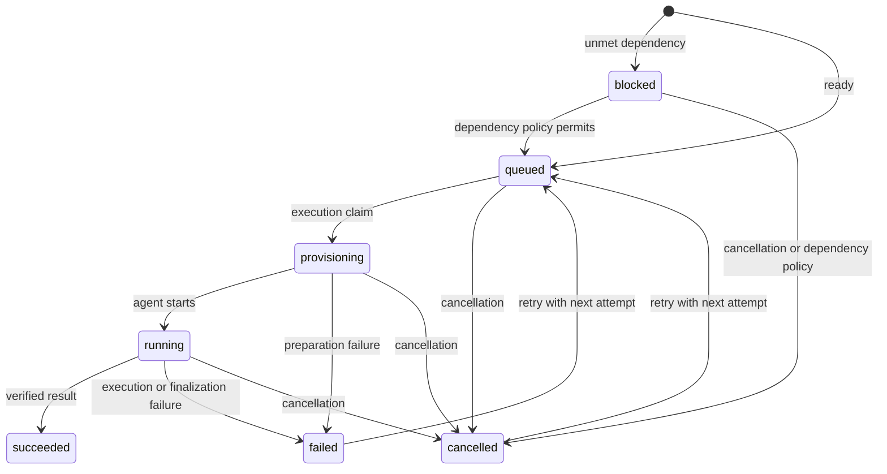

# Job lifecycle

A job retains its admitted instruction and configuration across numbered attempts.
An attempt records one execution outcome.

## Admission

1. Authenticate the client token.
2. Validate the envelope and payload.
3. Resolve registered names and the result sink.
4. Validate the task branch for Git work.
5. Resolve dependency edges and their ownership.
6. Capture admitted repository, environment, and plugin definitions with their digests.
7. Insert the job, first attempt, initial event, and dispatch state in one transaction.

A repeated token and idempotency key returns the existing job.
A conflicting token cannot reuse that key.
An atomic batch admits all items or none.

## State transitions

Success cannot transition back to queued.
Retries retain the admitted snapshot and job ID.
A new instruction or environment requires a new job.

## Dependency edges

`job_dependencies` stores a directed edge from the dependent job to its prerequisite.
Both jobs must have the same owner.
A dependency can reference an existing job ID or a same-batch reference.
Self-dependencies and cycles are refused.

| `on_failure` | Effect when the prerequisite fails or is cancelled |
| --- | --- |
| `cancel` | Cancel the dependent job. This is the default. |
| `block` | Keep the dependent job blocked. |
| `proceed` | Permit that edge to resolve without success. |

The scheduler evaluates all dependency edges before it queues dependent work.
Dependency artifacts are recorded for downstream workspace preparation.
An explicit `base` can select the Git base.
Without an explicit base, applicable dependency output can supply the downstream Git base.

## Attempt execution

The attempt reserves capacity and acquires a fencing lease.
A local supervisor or remote worker executes the captured plan.
The runner records provision, pre-step, agent, post-step, finalization, and cleanup events.
Step commands use declared executables and argument arrays.
Timeouts and boundary failures become durable failures.

Cancellation commits state before runtime interruption.
Cleanup releases the container and temporary credential state.
A cancellation does not undo completed external tool actions.

## Finalization

| Sink | Success condition |
| --- | --- |
| `git` | Safe committed output, valid base and head revisions, and clean worktree. |
| `files` | Safe archive, verified digest, and result stored by the house. |
| `none` | Completion metadata accepted by the house. |

The remote files path uploads the blob before completion.
A missing or invalid blob prevents successful completion.
The worker returns results only to the manager associated with the offer.

### Git branch names

Each attempt uses `<task-branch>-run-NNN` and a separate worktree.
Successful finalization advances the task branch pointer.
A failed dirty attempt can publish its run branch after the same safety checks.
Run references are create-only. Task pointer updates use `--force-with-lease`.

The default pruning horizon for run branches is 30 days.
Pruning preserves a task branch while it remains a successful job's canonical pointer within the retention window.

## Events and delivery

Events use a contiguous sequence per job.
SSE replays retained events before following live changes.
Retention gaps cause explicit failure.
Terminal notifications use the token's configured destination.
The event ID supports receiver deduplication across retries.

## Recovery

Recovery finds expired active leases and stranded dispatch state.
It records failure once and releases the reservation.
A stale worker cannot complete with an expired fence.
See [distributed execution](distributed-execution.md) for worker-local leases and slots.
