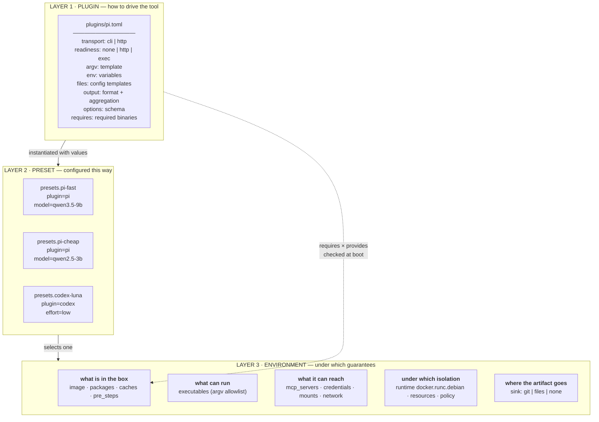
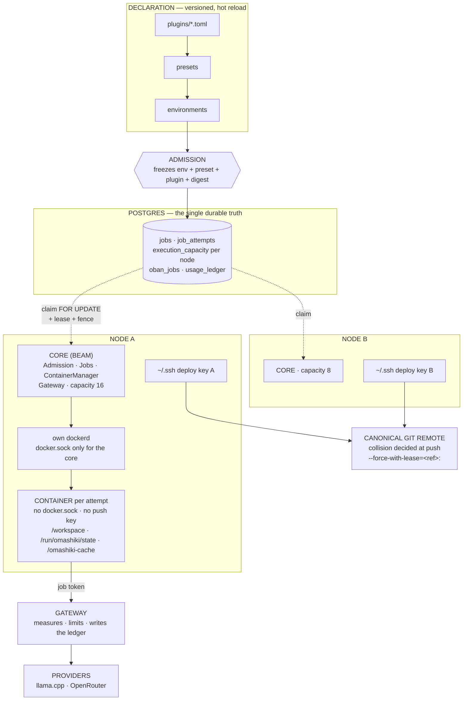
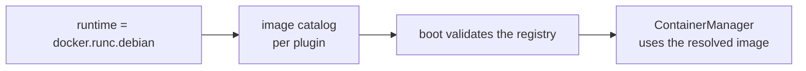
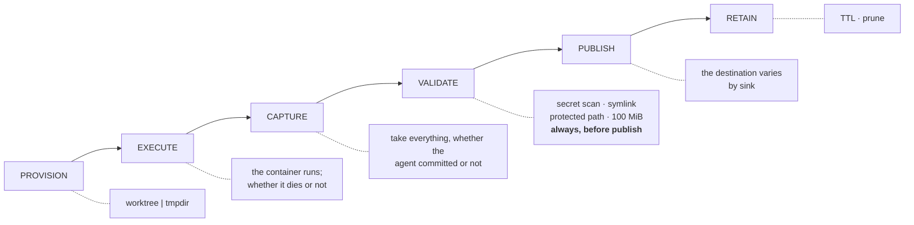
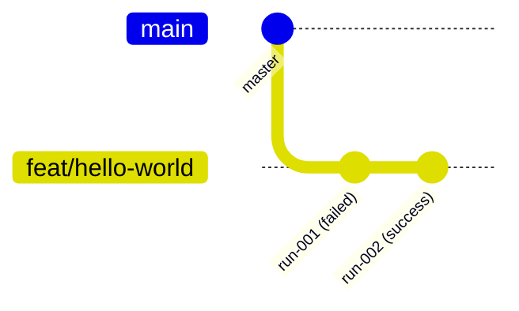
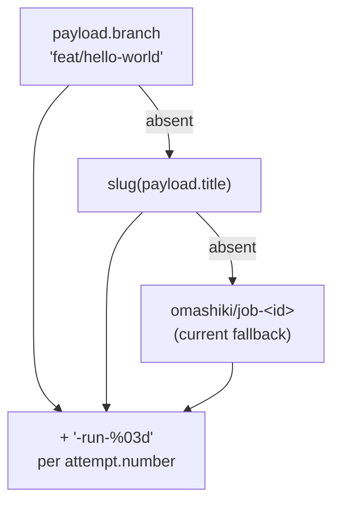
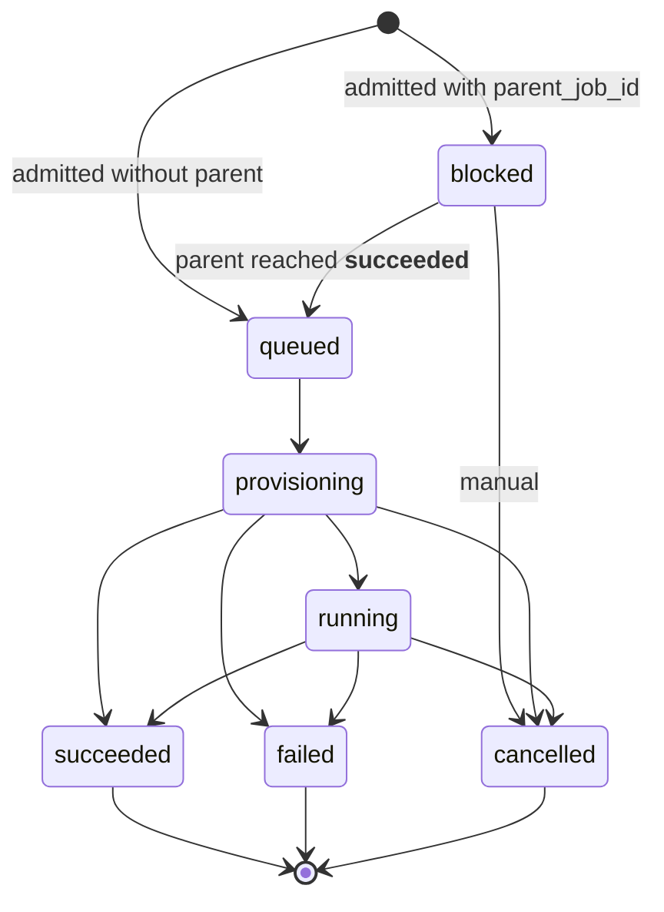
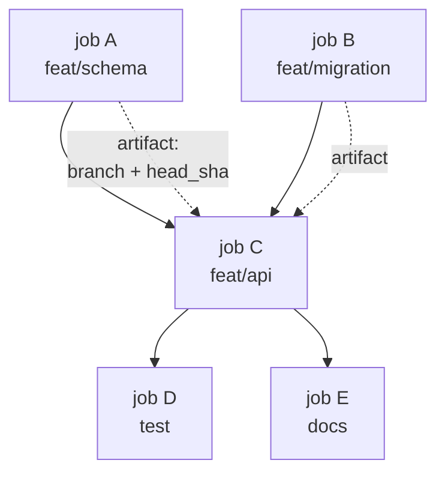

> **Design record, 2026-08.** Written while the declarative configuration cut
> was in progress. Several proposals below have shipped since: the three result
> sinks, `depends_on` with a failure policy, dependency artifacts on the child,
> and batch admission. Read [architecture.md](architecture.md) for the current
> system. Statements marked **today** describe the tree at commit `01ea60b`.

# Declarative plugins and the task lifecycle

> **Note:** this file was first written under `.temp/`, which is gitignored. A
> `git clean -xdf` deletes that directory. Commit `f33b715` promoted three
> documents from there to `docs/` for that reason, and two that stayed behind
> were lost. This one was promoted when the design settled.

Status: the declarative configuration cut is implemented. The plugin and sink
extensions described as proposals are still design. Each statement about the
current code was checked against the tree at `01ea60b` and is marked
**today**. Everything else is a proposal.

The current images live in the Docker catalogs `docker.runc.debian` and
`docker.kata.debian`. The `runc` and `kata` handlers are implemented at the
Docker configuration and API layer. Kata installation on the host or VM and
the compatibility gate may still be pending. Arch-based images are not
implemented.

---

## 1. The plugin concept

A plugin is a **pure declaration**: a manifest on disk. No third-party code
runs inside the core. One generic Elixir adapter reads the manifest. The tool
itself runs inside the container, as before.

### 1.1 Why

**Today** the declarative interpreter resolves the plugin code, and the
registry loads the presets in `presets.ex`:

```elixir
@adapter Omashiki.Plugin.Interpreter
```

The registry grows without new tool modules: a preset declares `plugin` and
`options`, and the manifest in `plugins/*.toml` defines how the tool is
driven.

The cost of adding a tool before this cut (measured in task 2821, which added
`pi`): a module with four callbacks, a Docker image, an entry in
`omashiki.toml`, wiring in `ci:docker`, a full test suite, an arch check, and
a merge cycle. With a manifest: one file.

### 1.2 The three layers



**The preset layer already exists.** It is declared in `[presets.*]`. Two
profiles of the same adapter with different options already work:

```toml
[presets.codex-luna]
plugin = "codex"
options = { model = "gpt-5.6-luna", reasoning_effort = "low" }
```

The confusing part is the name: `harness` mixes *which adapter* with *which
preset*.

### 1.3 The asymmetry that motivates the change

| Tool | Where the preset lives **today** |
|---|---|
| codex | `options = { model, reasoning_effort }`: declarative, in the TOML |
| opencode | **A file on the host**, attached to the credential: `[host_credentials.*].config` |

The opencode model is not declarable in the registry. To point it to another
model you edit a JSON file in `~/.config/`, outside version control and
outside the snapshot. The `@option_keys` of opencode accept only
`internal_port`, `readiness_timeout_ms`, `readiness_path`, `auth_path`, and
`config_path`.

`prepare/2` **already writes files** to the per-attempt state directory. The
adapter already owns the translation from declared options to the config
format of the tool. Only the preset lacks a place to declare them.

### 1.4 `requires` and `provides`

The manifest declares what the tool needs. The environment declares what the
image delivers. The core checks the two **at boot**.

This is not hypothetical. This failure class bit twice in one session:

- An image without `mise`: passes the size gate, passes the binary contract,
  **fails every job at runtime**, because `omashiki.toml` declares
  `pre_steps = [mise install --yes]`.
- An image without `curl`: `mise install` dies **before any compiler**,
  because `kerl` downloads the OTP tarball with curl. The comment in
  `agent/Dockerfile` attributed curl to the HEALTHCHECK. The attribution was
  incomplete.

Lesson from `.scripts/agent_toolchain_check.sh`: **checking the binary is
not checking the capability.** `mise --version` passes on an image whose
`mise install` compiles nothing. The gate must exercise the capability.

### 1.5 Manifest restrictions

**A template must not become execution.** Literal substitution of `{{var}}`
from a closed list. If it accepts a shell or an expression, third-party code
is back inside the core through another door, which is exactly what the
design avoids.

**Output aggregation differs per tool.** `jcode` emits one object.
`pi --mode json` emits JSONL with usage **per message**. Porting the parser
from one to the other undercounts a multi-turn job by the number of turns.
The manifest must declare the format *and* how to aggregate.

### 1.6 Multi-node: the manifest enters the snapshot

The manifest is a file on disk **per node**. If `plugins/pi.toml` on node B
differs from node A, node B runs the job with a different argv than the one
that was admitted.

This is the same defect class found in task 2820: the snapshot stored the
**name** of the credential and resolved it **live**, so a job that waited in
the queue during a reload was provisioned with the new model while its own
digest said otherwise. Fixed with `Credentials.admitted/2`.

**Therefore: the resolved manifest enters the job snapshot, not only its
name.**

---

## 2. Execution topology



### 2.1 The four boundaries

**Admission** separates what changes hot from what does not. Every arrow
that crosses it is a potential bug. That is how the credential defect
appeared.

**`docker.sock` stays in the core. The push key stays in the `~/.ssh` of the
node.** Neither enters the container. If the key entered, the agent would
push directly and skip the secret scan, the symlink check, the protected
path check, and the 100 MiB limit. That is why `finalize` pushes only
**after** the validations, and why `GIT_TERMINAL_PROMPT=0`: a push that
stops to ask for a password would hold the attempt until the lease expires.

**One deploy key per node, never shared.** This lets you revoke one node
without taking down the others.

**The container talks only to the gateway.** That is what gives measurement
and a ledger. Consequence **today**: one gateway per node means one budget
per node. **There is no cluster ceiling.**

### 2.2 Why N nodes scale

The measured ceiling is not CPU or memory. It is dockerd serializing
create/start at 5–20 per second, and that ceiling is **per daemon**. Three
nodes, three daemons, three times the ceiling.

That is why distributed execution comes before Kata. Kata costs 100–150 MB
per sandbox and **does not move that number**. Its gain is the isolation
boundary, not density.

### 2.3 Runtime is a policy of the environment

**Today** the runtime lives in the environment, and the catalog resolves the
image by plugin:

```toml
[runtimes.docker.runc.debian.images]
opencode = "omashiki/agent:latest"

[environments.opencode]
runtime = "docker.runc.debian"
```

Docker is the current backend. The `runc` and `kata` handlers are
implemented at the Docker configuration and API layer, and
`docker.runc.debian` is the default. Selecting `docker.kata.debian` still
depends on Kata installation on the host or VM and on the compatibility
gate. This document does not claim that the Kata E2E passed. A future
backend can keep the same separation:



Isolation is a governance guarantee, not a property of the tool. `pi` does
not know or care whether it runs in Docker or in a future microVM backend.
`runtime` belongs to the environment:

```toml
[environments.dev]
runtime = "docker.runc.debian"   # default handler

# Kata is selectable at the Docker/API layer, but needs host/VM
# installation and validation before use.
```

With `runtime` on the plugin, changing the backend would force you to
duplicate the whole profile.

---

## 3. Task lifecycle

### 3.1 Stages, the same for every task



**Only `PROVISION` and `PUBLISH` vary.** The other four are universal, and
`VALIDATE` staying universal is what guarantees that no secret leaks,
whatever the destination.

### 3.2 Sinks

| Sink | Provision | Publish | Retain |
|---|---|---|---|
| `git` | worktree from `base_branch` | commit + push to the canonical remote | branch expiry |
| `files` | tmpdir | declared `out_dir` → blob + digest | TTL |
| `none` | tmpdir | `jobs.result` + steps + events | ledger retention |

**Today** (at `01ea60b`) only `git` exists, implicitly: `repository_snapshot`
is a **required** field of the job. A non-coding task cannot be expressed.
Opening this means making `repository` optional and dispatching
`PROVISION`/`PUBLISH` by sink.

### 3.3 Naming in git

**Today:**

```
branch   = "omashiki/job-<uuid>"                    ← per JOB
worktree = ".omashiki-worktrees/job-<uuid>"
```

Opaque, and a retry collides with the branch of its own previous attempt.
But `job_attempts` **already has** `branch`, `base_sha`, `head_sha`, and
`worktree_clean` **per attempt**. The schema anticipated the design below.
The name collapsed everything into one.

**Proposed:**



Full refs:

```
master                          declared base
└─ feat/hello-world             TASK branch: pointer to the last good run
   ├─ feat/hello-world-run-001  attempt 1, immutable
   └─ feat/hello-world-run-002  attempt 2 (retry), immutable
```

**The dash is required, not aesthetic.** Git refs are a directory hierarchy
and a name cannot be a file and a directory at the same time. Verified:

```
$ git branch feat/hello
$ git branch feat/hello/run-001
fatal: cannot lock ref 'refs/heads/feat/hello/run-001':
       'refs/heads/feat/hello' exists
```

Name resolution, in cascade:



**Open decision:** `finalize` commits everything that is dirty, whether the
agent wants it or not. With `run-NNN` this becomes a permanent history of
**every** attempt, including the ones that failed badly. It is the requested
behavior, but it is the opposite of discarding a bad attempt, and it needs
confirmation.

---

## 4. Dependencies between tasks

### 4.1 What existed at `01ea60b`



- `parent_job_id`: **one parent only**, not a DAG
- the child is admitted as `blocked` (`admission.ex:292`)
- `unlock_children!` moves `blocked → queued`, ordered by priority and then
  by insertion
- children are locked with `FOR UPDATE` and each one gets a `queued` event
  that carries `parent_job_id` and `unlock_event_id`

### 4.2 The three holes

**1. A parent that fails leaves the children stuck forever.**
`unlock_children!` is called **only** on the `succeeded` branch
(`jobs.ex:437`). From `blocked` the only transition is `cancelled`, manual.
There is no cascade-cancel and no `on_failure` path.

**2. One parent only, not a DAG.** "This task depends on A **and** B" cannot
be expressed. Chaining in a line changes the meaning: it serializes what
could run in parallel, and the result depends on the chosen order.

**3. Nothing passes from parent to child.** The child does not get the
branch, the `head_sha`, or the `result` of the parent. A task "review what
the previous one did" cannot know what was done.

### 4.3 Proposal (shipped since)



- `depends_on: [id, id]` instead of `parent_job_id`: unblocks when **all**
  dependencies reach `succeeded`
- a declared policy for a failed dependency: `block` (the old behavior),
  `cancel` (cascade), `proceed` (run anyway)
- the artifact of the dependency enters the payload of the child: branch,
  `head_sha`, `result`
- the **base of the child worktree** can be the `head_sha` of the
  dependency instead of `base_branch`. This is what makes chaining useful.

The graph must be **acyclic and validated at admission**, not at runtime. A
cycle found at runtime is a silent deadlock, and `blocked` has no timeout.

---

## 5. Summary of gaps at `01ea60b`

| # | Gap | Evidence |
|---|---|---|
| 1 | a plugin needs code; there is no manifest | `plugins/*.toml` and `presets.ex` |
| 2 | the opencode preset lives outside the registry | `[host_credentials.*].config` |
| 3 | `requires`/`provides` is not checked | broke twice in one day: `mise`, `curl` |
| 4 | runtime and image need a validated catalog | `[runtimes.docker.runc.debian.images]` and `[runtimes.docker.kata.debian.images]` |
| 5 | `packages[]` does not exist | "I want python" is not declarable |
| 6 | branch per job, not per attempt | `git_artifact.ex:30,262` |
| 7 | `repository_snapshot` is required | a non-coding task is impossible |
| 8 | a failed parent strangles the children | `jobs.ex:437` |
| 9 | one parent only, not a DAG | `job.ex:38` |
| 10 | the parent artifact does not reach the child | — |
| 11 | the gateway budget is per node | no cluster ceiling |
| 12 | the manifest does not enter the snapshot | same class as defect 2820 |

---

## 6. Revised dictionary

The current vocabulary has real collisions. They are not pedantry. Each one
below caused a documented misreading in one session, by me or by a Builder.
The **today** column is what the code says; **revised** is the proposed
term.

### 6.1 The collisions that cost the most

| Today | Ambiguity | Revised | Why |
|---|---|---|---|
| **harness** | the Elixir module *or* the configured profile | **adapter** (code) · **preset** (profile) | `[presets.codex-luna]` is a preset of the `codex` plugin. One term for two layers makes the change hard to discuss |
| **runtime** | the backend selected in the environment or the `Omashiki.Runtime.*` namespace | **runtime** (`docker.runc.debian` / `docker.kata.debian`) · **Execution** (namespace) · "running" (prose) | `runtime/` and `runtimes/` are two directories one letter apart with different meanings: `runtime/` supervises attempts and containers, `runtimes/` holds the backend configuration |
| **environment** | the governed environment `[environments.*]` *or* an OS environment variable | **environment** (governed) · **os_env** (variable) | `${env:VAR}` and the manifest `env` block are OS variables; `[environments.*]` is execution policy. They collide in every sentence |
| **node** | an Omashiki machine · a BEAM node · a graph node | **machine** (Omashiki) · **beam_node** · **vertex** | `Omashiki.Config.Node` literally shadows Elixir's `Node`, flagged by the Builder of task 2797 |
| **credential** | LLM key · harness auth file · SSH push key | **llm_credential** · **host_credential** · **push_key** | Three things with different lifecycles and security boundaries: the first goes to the gateway, the second enters the container, **the third never enters** |
| **capacity** | the row per machine · the cluster sum · a slot of the model server | **machine_capacity** · **cluster_capacity** · **model_slot** | I confused the last two in one day: "concurrency 64 = 2× capacity" using 32 slots from the runbook when the real config gave 8 |
| **snapshot** | config frozen on the job · cache snapshot · inspector census | **admitted_config** · **cache_snapshot** · **census** | 137 uses of `snapshot` in the code, three meanings |
| **digest** | registry · environment · repository · payload hash | keep all four **always qualified** | `digest` alone means nothing. Never use it without a prefix |
| **step** | a row in `job_steps` · `pre_steps`/`post_steps` · telemetry `:step` | **step** (job_steps) · **lifecycle_step** (pre/post) · **span** (telemetry) | Three different axes with one name |
| **provider** | LLM vendor · `Gateway.Providers.*` module | **provider** (vendor) · **provider_adapter** (module) | The second translates a protocol. It is not who serves the model |
| **model** | LLM model id | **model**, reserved for this only | Never use it for an Ecto schema; use **schema** |
| **registry** | `Config.Registry` (the parsed TOML) · adapter registry · Docker registry | **registry** (TOML) · **adapter_map** · **image_registry** | — |

### 6.2 New terms the design introduces

| Term | Definition |
|---|---|
| **plugin** | a declarative manifest on disk that describes how to drive a tool. **Never code.** A generic adapter interprets it |
| **preset** | plugin + option values, named. Declared in `[presets.*]` |
| **sink** | destination of the artifact: `git` \| `files` \| `none`. Decides `PROVISION` and `PUBLISH`; the other four stages do not change |
| **task branch** | `feat/hello-world`: pointer to the last successful run |
| **run branch** | `feat/hello-world-run-001`: immutable, one per attempt. The dash is imposed by git, not a choice |
| **requires** | binaries the plugin needs in the image |
| **provides** | what the environment delivers: image + packages + caches |
| **generation** | one config load. Only the live one stays in `persistent_term`; the previous one lives in the job snapshots |
| **rollout** | the transition between generations. `gradual` \| `drain_all` |

### 6.3 State vocabulary: keep as is

These are already unambiguous and **must not change**. They are invariant
vocabulary and appear in database constraints:

`blocked` · `queued` · `provisioning` · `running` · `succeeded` · `failed` · `cancelled`

One distinction that is **not** ambiguous and is worth reinforcing instead
of renaming:

- **job**: the durable request. One per admitted payload. Survives everything
- **attempt**: one execution of the job. `job_attempts.number` counts 1, 2, 3…
- **run**: informal synonym of attempt. **Do not use it in code or config**;
  use it only in the run branch name, where it is already the user's
  convention

### 6.4 General rule

When a noun can mean two layers, **qualify it or rename it**. Do not rely on
context. The three corrections I had to make in one session (wrong network
mode, a migration `down` reported as broken, `ContainerManager` described
wrongly twice) all started with reading a term at the wrong layer.
