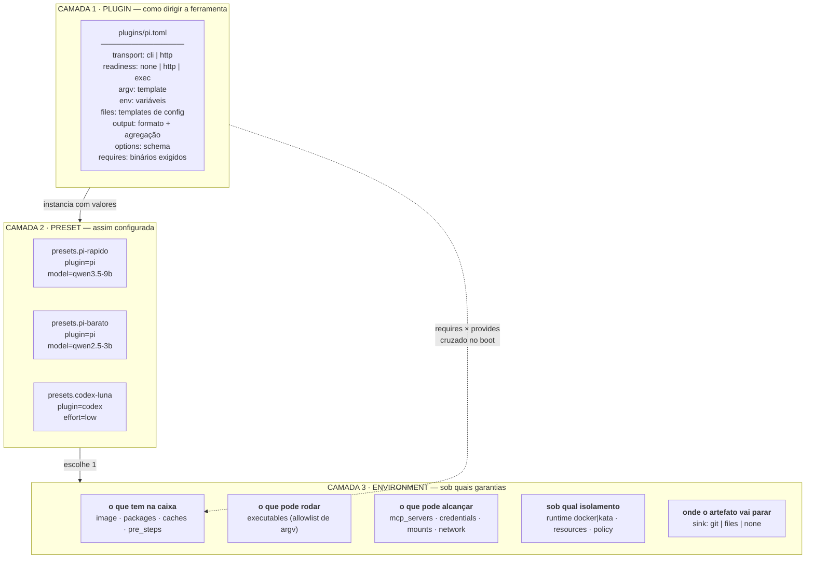
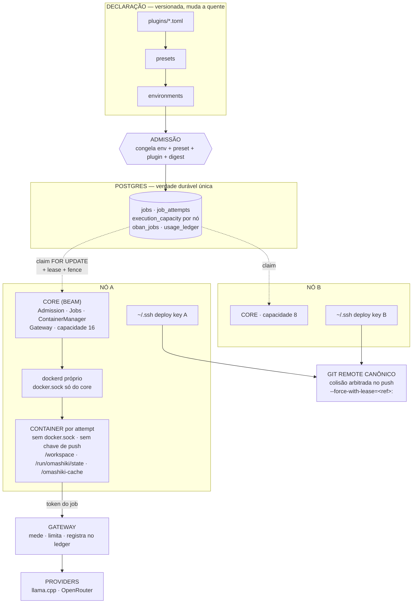
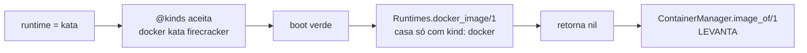
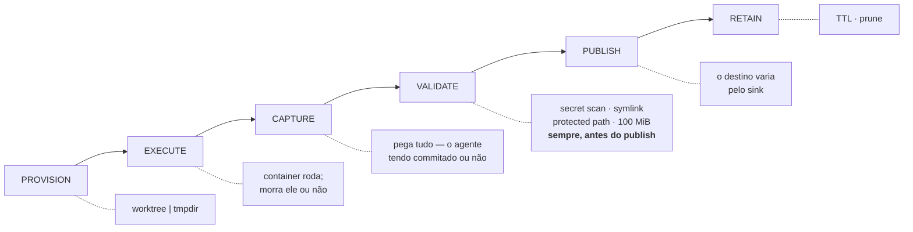
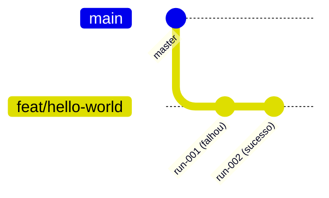
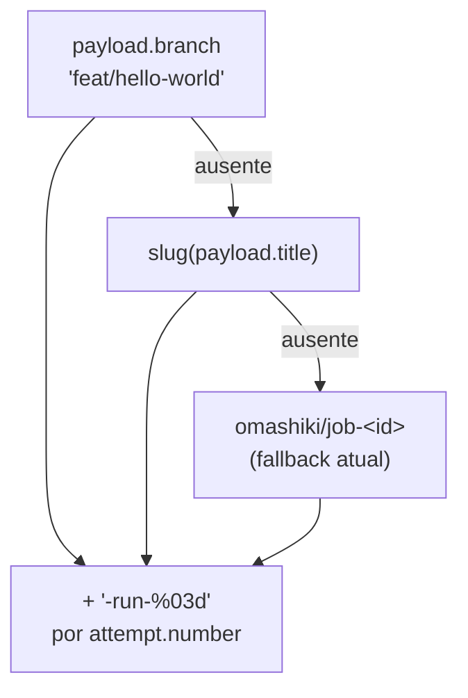
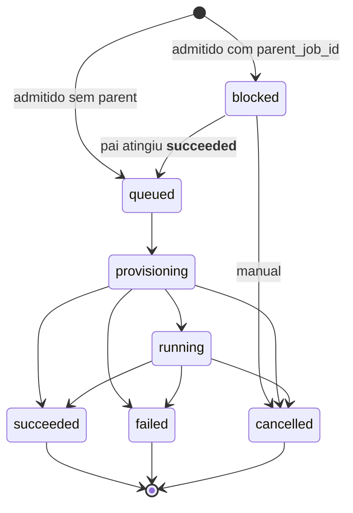
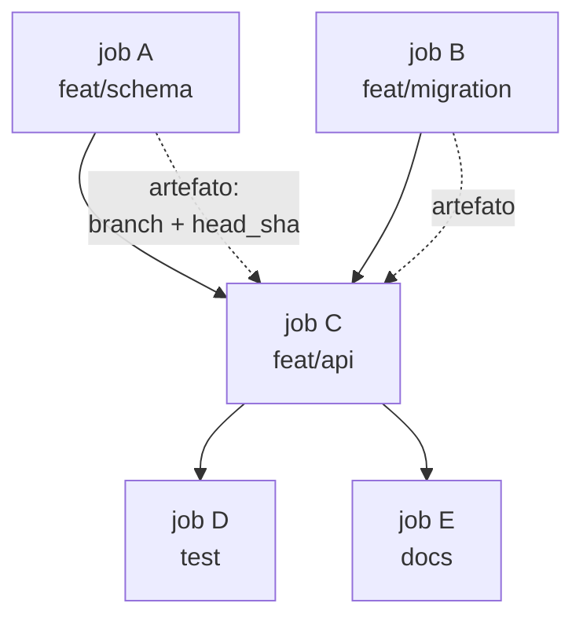

> **Implementation in progress** under Omakiten plan 196 (`plugins-cut-2026h2`). Vocabulary and config shape are changing; this document describes the target design.

# Plugins declarativos e ciclo de vida das tarefas

> **Aviso:** `.temp/` é gitignored. Um `git clean -xdf` apaga este arquivo. O commit
> `f33b715` promoveu três documentos daqui para `docs/` exatamente por isso, e dois que
> ficaram foram perdidos. Promova este quando o desenho estabilizar.

Estado: **desenho**, não implementação. Cada afirmação sobre o código atual foi verificada
contra a árvore em `01ea60b` e está marcada como **hoje**; o resto é proposta.

---

## 1. O conceito de plugin

Plugin aqui é **declaração pura** — um manifesto em disco. Nada de terceiros roda dentro do
core. Um único adapter genérico em Elixir interpreta o manifesto; a ferramenta em si roda
dentro do container, como sempre.

### 1.1 Por que

**Hoje** um harness é um módulo Elixir compilado, resolvido por um mapa em
`harnesses.ex:9-12`:

```elixir
@default_adapters %{
  "opencode" => Omashiki.Harness.OpenCode,
  "claude-code" => Omashiki.Harness.ClaudeCode,
  "codex" => Omashiki.Harness.Codex,
  "jcode" => Omashiki.Harness.Jcode
}
```

O registro **já é extensível** — `fetch_adapter!/1` faz
`Map.merge(@default_adapters, Application.get_env(:omashiki, :harness_adapters, %{}))`. O que
falta para ser plugin não é abrir o mapa: é **não precisar de código novo**.

Custo atual de adicionar uma ferramenta (medido na task 2821, que adicionou o `pi`): módulo
com 4 callbacks, imagem Docker, entrada no `omashiki.toml`, fiação no `ci:docker`, suíte
completa, arch check e ciclo de merge. Com manifesto: um arquivo.

### 1.2 As três camadas



**A camada de preset já existe** — é o que hoje se chama `[harnesses.*]`. Dois perfis do mesmo
adapter com opções diferentes já funcionam:

```toml
[harnesses.codex-luna]
adapter = "codex"
options = { model = "gpt-5.6-luna", reasoning_effort = "low" }
```

O que confunde é o nome: `harness` mistura *qual adapter* com *qual preset*.

### 1.3 A assimetria que motiva a reforma

| ferramenta | onde vive o preset **hoje** |
|---|---|
| codex | `options = { model, reasoning_effort }` — declarativo, no TOML |
| opencode | **arquivo no host**, pendurado na credencial: `[host_credentials.*].config` |

O modelo do opencode não é declarável no registro. Para apontá-lo a outro modelo é preciso
editar um JSON em `~/.config/`, fora do controle de versão e fora do snapshot. `@option_keys`
do opencode aceita apenas `internal_port`, `readiness_timeout_ms`, `readiness_path`,
`auth_path`, `config_path`.

O `prepare/2` **já escreve arquivos** no diretório de estado por attempt. O adapter já é o dono
da tradução "opções declarativas → formato de config da ferramenta"; falta só o preset ter onde
declarar.

### 1.4 `requires` × `provides`

O manifesto declara o que a ferramenta exige; o environment declara o que a imagem entrega; o
core cruza os dois **no boot**.

Isto não é hipotético — é a classe de falha que mordeu duas vezes nesta sessão:

- Imagem sem `mise`: passa no gate de tamanho, passa no contrato de binários, **falha todo job
  em runtime**, porque `omashiki.toml` declara `pre_steps = [mise install --yes]`.
- Imagem sem `curl`: `mise install` morre **antes de qualquer compilador**, porque o `kerl`
  baixa o tarball do OTP com curl. O comentário em `agent/Dockerfile` atribuía o curl ao
  HEALTHCHECK — atribuição incompleta.

Corolário aprendido em `.scripts/agent_toolchain_check.sh`: **checar o binário não é checar a
capacidade.** `mise --version` passa numa imagem cujo `mise install` não compila nada. O gate
tem de exercitar a capacidade.

### 1.5 Restrições do manifesto

**Template não pode virar execução.** Substituição literal de `{{var}}` a partir de uma lista
fechada. Se aceitar shell ou expressão, código de terceiro voltou para dentro do core por outra
porta — que é exatamente o que o desenho quer evitar.

**A agregação de saída difere por ferramenta.** `jcode` emite um objeto; `pi --mode json` emite
JSONL com usage **por mensagem**. Portar o parser de um para o outro sub-conta um job
multi-turno pelo número de turnos. O manifesto precisa declarar formato *e* como agregar.

### 1.6 Multi-nó: o manifesto entra no snapshot

O manifesto é arquivo em disco **por nó**. Se `plugins/pi.toml` do nó B diverge do A, o B roda o
job com argv diferente do que foi admitido.

É a mesma classe do defeito real encontrado na task 2820: o snapshot guardava o **nome** da
credencial e a resolução acontecia **ao vivo**, então um job parado na fila durante um reload
seria provisionado com o modelo novo enquanto o próprio digest dizia outra coisa. Corrigido com
`Credentials.admitted/2`.

**Portanto: o manifesto resolvido entra no snapshot do job, não só o seu nome.**

---

## 2. Topologia de execução



### 2.1 As quatro fronteiras

**Admissão** separa o que muda a quente do que não muda. Toda seta que a atravessa é um bug em
potencial — foi assim que o defeito da credencial apareceu.

**`docker.sock` fica no core; a chave de push fica no `~/.ssh` do nó.** Nenhum dos dois entra no
container. Se a chave entrasse, o agente empurraria direto e pularia o secret scan, o symlink
check, o protected path e o limite de 100 MiB. Por isso `finalize` só empurra **depois** das
validações, e por isso `GIT_TERMINAL_PROMPT=0` — push que para pedindo senha seguraria o attempt
até o lease expirar.

**Deploy key por nó, nunca compartilhada** — permite revogar um nó sem derrubar os outros.

**Container só fala com o gateway.** É o que dá medição e ledger. Consequência **hoje**: um
gateway por nó significa orçamento por nó — **não existe teto de cluster**.

### 2.2 Por que N nós escalam

O teto medido não é CPU nem memória: é o dockerd serializando create/start em 5-20/s, e esse
teto é **por daemon**. Três nós, três daemons, três vezes o teto.

É por isso que distribuído vem antes de kata. Kata custa 100-150 MB por sandbox e **não move
esse número** — o ganho dele é fronteira de isolamento, não densidade.

### 2.3 Runtime está na camada errada

**Hoje** `runtime` fica no `Spec` do harness:

```toml
[harnesses.opencode]
runtime = "docker"      # omashiki.toml:164
```

Trocar para `kata` **passa no boot e explode no primeiro job**:



Isolamento é garantia de governança, não propriedade da ferramenta. O `pi` não sabe nem se
importa se roda em docker ou microVM. `runtime` pertence ao environment:

```toml
[environments.dev]     runtime = "docker"   # barato, confiável
[environments.hostil]  runtime = "kata"     # mesmo preset, isolamento maior
```

Com `runtime` no plugin, mudar o isolamento obriga a duplicar o perfil inteiro.

---

## 3. Ciclo de vida da tarefa

### 3.1 Estágios — iguais para toda tarefa



**Só `PROVISION` e `PUBLISH` variam.** Os outros quatro são universais — e `VALIDATE` continuar
universal é o que garante que nada vaza segredo, seja qual for o destino.

### 3.2 Sinks

| sink | provision | publish | retain |
|---|---|---|---|
| `git` | worktree a partir de `base_branch` | commit + push no remote canônico | expiração de branch |
| `files` | tmpdir | `out_dir` declarado → blob + digest | TTL |
| `none` | tmpdir | `jobs.result` + steps + events | retenção do ledger |

**Hoje** só existe `git`, e implicitamente: `repository_snapshot` é campo **obrigatório** do
job. Tarefa não-coding não é expressável. Abrir isso é tornar `repository` opcional e despachar
`PROVISION`/`PUBLISH` por sink.

### 3.3 Nomeação no git

**Hoje:**

```
branch   = "omashiki/job-<uuid>"                    ← por JOB
worktree = ".omashiki-worktrees/job-<uuid>"
```

Opaco, e um retry colide com a branch da própria tentativa anterior. Mas `job_attempts` **já
tem** `branch`, `base_sha`, `head_sha`, `worktree_clean` **por attempt** — o esquema antecipou o
desenho abaixo; o nome é que colapsou tudo num só.

**Proposto:**



Refs completas:

```
master                          base declarada
└─ feat/hello-world             branch da TAREFA — ponteiro para o último run bom
   ├─ feat/hello-world-run-001  attempt 1, imutável
   └─ feat/hello-world-run-002  attempt 2 (retry), imutável
```

**O traço é obrigatório, não estético.** Refs do git são hierarquia de diretório e um nome não
pode ser arquivo e pasta ao mesmo tempo. Verificado:

```
$ git branch feat/hello
$ git branch feat/hello/run-001
fatal: cannot lock ref 'refs/heads/feat/hello/run-001':
       'refs/heads/feat/hello' exists
```

Resolução do nome, em cascata:



**Decisão em aberto:** `finalize` commita tudo que está sujo, o agente querendo ou não. Com
`run-NNN` isso vira histórico permanente de **toda** tentativa, inclusive as que falharam feio.
É o comportamento pedido — mas é o oposto de descartar tentativa ruim, e vale confirmar.

---

## 4. Dependência entre tarefas

### 4.1 O que existe hoje



- `parent_job_id` — **um pai só**, não é DAG
- filho admitido em `blocked` (`admission.ex:292`)
- `unlock_children!` move `blocked → queued`, ordenado por prioridade e depois inserção
- os filhos são travados com `FOR UPDATE` e cada um recebe evento `queued` carregando
  `parent_job_id` e `unlock_event_id`

### 4.2 Os três buracos

**1. Pai que falha deixa os filhos presos para sempre.** `unlock_children!` é chamado **só** no
ramo `succeeded` (`jobs.ex:437`). De `blocked` a única transição é `cancelled`, manual. Não há
cascade-cancel nem caminho `on_failure`.

**2. Um pai só, não um DAG.** "esta tarefa depende de A **e** B" não é expressável. Encadear em
linha muda a semântica: serializa o que poderia ser paralelo, e o resultado passa a depender da
ordem escolhida.

**3. Nada passa do pai para o filho.** O filho não recebe branch, `head_sha` nem `result` do
pai. Uma tarefa "revise o que a anterior fez" não tem como saber o que foi feito.

### 4.3 Proposta



- `depends_on: [id, id]` em vez de `parent_job_id` — desbloqueia quando **todas** as
  dependências chegam a `succeeded`
- política declarada para dependência que falha: `block` (atual), `cancel` (cascata),
  `proceed` (roda mesmo assim)
- o artefato da dependência entra no payload do filho: branch, `head_sha`, `result`
- **base do worktree do filho** passa a poder ser o `head_sha` da dependência, não a
  `base_branch` — é o que torna encadeamento útil de verdade

O grafo tem de ser **acíclico e validado na admissão**, não em runtime: ciclo descoberto em
runtime é deadlock silencioso, e `blocked` não tem timeout.

---

## 5. Resumo das lacunas

| # | lacuna | evidência |
|---|---|---|
| 1 | harness exige código; não há manifesto | `harnesses.ex:9-12` |
| 2 | preset do opencode vive fora do registro | `[host_credentials.*].config` |
| 3 | `requires`/`provides` não é cruzado | quebrou 2× hoje: `mise`, `curl` |
| 4 | `runtime` no plugin; kata explode no primeiro job | `runtimes.ex:9-23` |
| 5 | `packages[]` não existe | "quero python" não é declarável |
| 6 | branch por job, não por attempt | `git_artifact.ex:30,262` |
| 7 | `repository_snapshot` obrigatório | tarefa não-coding impossível |
| 8 | pai que falha estrangula os filhos | `jobs.ex:437` |
| 9 | um pai só, não DAG | `job.ex:38` |
| 10 | artefato do pai não chega ao filho | — |
| 11 | orçamento do gateway é por nó | sem teto de cluster |
| 12 | manifesto não entra no snapshot | mesma classe do defeito 2820 |

---

## 6. Dicionário revisado

O vocabulário atual tem colisões reais — não são preciosismo. Cada uma abaixo causou um erro de
leitura documentado nesta sessão, meu ou de um Builder. A coluna **hoje** é o que o código diz;
**revisado** é o termo proposto.

### 6.1 As colisões que mais custam

| hoje | ambiguidade | revisado | por quê |
|---|---|---|---|
| **harness** | é o módulo Elixir *ou* o perfil configurado | **adapter** (código) · **preset** (perfil) | `[harnesses.codex-luna]` não é um harness, é um preset do adapter `codex`. Um termo para duas camadas impede falar da reforma |
| **runtime** | 3 sentidos: kind docker\|kata · o namespace `Omashiki.Runtime.*` · "em tempo de execução" | **isolation** (docker\|kata) · **Execution** (namespace) · "em execução" (prosa) | `runtime/` e `runtimes/` são dois diretórios a uma letra de distância com significados distintos: `runtime/` supervisiona attempts e containers, `runtimes/` guarda o struct de isolamento **e** o cache |
| **environment** | ambiente governado `[environments.*]` *ou* variável de ambiente do SO | **environment** (governado) · **os_env** (variável) | `${env:VAR}` e o bloco `env` do manifesto são variáveis do SO; `[environments.*]` é política de execução. Colidem em toda frase |
| **node** | máquina Omashiki · nó BEAM · nó de grafo | **machine** (Omashiki) · **beam_node** · **vertex** | `Omashiki.Config.Node` literalmente sombreia o `Node` do Elixir — sinalizado pelo Builder da 2797 |
| **credential** | chave de LLM · arquivo de auth do harness · chave SSH de push | **llm_credential** · **host_credential** · **push_key** | São três coisas com ciclos de vida e fronteiras de segurança diferentes: a primeira vai ao gateway, a segunda entra no container, **a terceira nunca entra** |
| **capacity** | linha por máquina · soma do cluster · slot do servidor de modelo | **machine_capacity** · **cluster_capacity** · **model_slot** | Confundi os dois últimos hoje: disse "concorrência 64 = 2× a capacidade" usando 32 slots do runbook quando a config real dava 8 |
| **snapshot** | config congelada no job · snapshot de cache · censo do inspector | **admitted_config** · **cache_snapshot** · **census** | 137 usos de `snapshot` no código, três significados |
| **digest** | registry · environment · repository · hash do payload | manter os quatro **sempre qualificados** | `digest` sozinho não quer dizer nada. Nunca usar sem prefixo |
| **step** | linha em `job_steps` · `pre_steps`/`post_steps` · telemetria `:step` | **step** (job_steps) · **lifecycle_step** (pre/post) · **span** (telemetria) | Três eixos diferentes com um nome |
| **provider** | fornecedor de LLM · módulo `Gateway.Providers.*` | **provider** (fornecedor) · **provider_adapter** (módulo) | O segundo traduz protocolo, não é quem serve o modelo |
| **model** | id do modelo de LLM | **model** — reservar só para isto | Nunca usar para schema Ecto; usar **schema** |
| **registry** | `Config.Registry` (o TOML parseado) · registro de adapters · registry Docker | **registry** (TOML) · **adapter_map** · **image_registry** | — |

### 6.2 Termos novos que o desenho introduz

| termo | definição |
|---|---|
| **plugin** | manifesto declarativo em disco que descreve como dirigir uma ferramenta. **Nunca código.** Um adapter genérico o interpreta |
| **preset** | plugin + valores de opção, nomeado. O que hoje é `[harnesses.*]` |
| **sink** | destino do artefato: `git` \| `files` \| `none`. Determina `PROVISION` e `PUBLISH`; os outros quatro estágios não mudam |
| **task branch** | `feat/hello-world` — ponteiro para o último run bem-sucedido |
| **run branch** | `feat/hello-world-run-001` — imutável, um por attempt. O traço é imposto pelo git, não é escolha |
| **requires** | binários que o plugin exige na imagem |
| **provides** | o que o environment entrega: image + packages + caches |
| **generation** | uma carga de config. Só a viva fica em `persistent_term`; a anterior vive nos snapshots dos jobs |
| **rollout** | a transição entre gerações. `gradual` \| `drain_all` |

### 6.3 Vocabulário de estados — manter como está

Estes já são inequívocos e **não devem mudar**; são vocabulário de invariante e aparecem em
constraints do banco:

`blocked` · `queued` · `provisioning` · `running` · `succeeded` · `failed` · `cancelled`

Uma distinção que **não** é ambígua e vale reforçar em vez de renomear:

- **job** — o pedido durável. Um por payload admitido. Sobrevive a tudo
- **attempt** — uma execução do job. `job_attempts.number` conta 1, 2, 3…
- **run** — sinônimo informal de attempt. **Não usar em código nem em config**; usar apenas
  no nome da run branch, onde já é convenção do usuário

### 6.4 Regra geral

Quando um substantivo puder significar duas camadas, **qualifique ou renomeie** — não confie no
contexto. As três correções que precisei fazer nesta sessão (modo de rede errado, `down` de
migração dada como quebrada, `ContainerManager` descrito errado duas vezes) começaram todas em
ler um termo na camada errada.
